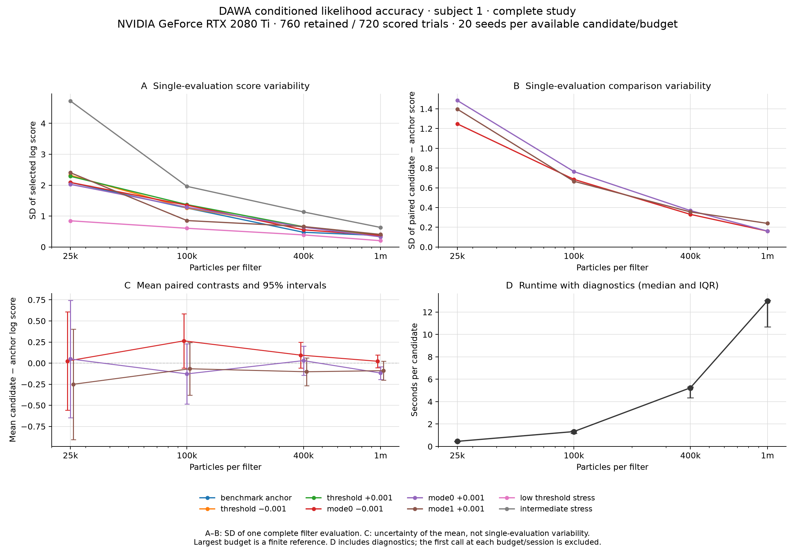

# Particle-filter likelihood accuracy

This study checks the observation-conditioned sampler introduced in
`2f2f0c778f`. It separates correctness of the filtering recursion from finite
particle error on DAWA. The target remains the original 10 ms model with noise
SD 0.1 in every LCA and the declared histogram observation model. This is not
a continuous-time or unsmoothed likelihood validation.

The reference checks support the implemented filtering recursion. The complete
subject study shows substantially lower Monte Carlo variation at larger budgets,
but does **not** establish uniform ±0.2-log-unit accuracy. A 100,000-particle
budget is useful for exploratory comparisons in this candidate set; fine LC-mode
comparisons need larger budgets and independent repetitions.

## Independent reference checks

The [three-state HMM test](../../../../tests/composition/pec/test_batched_conditioned_hmm.py)
uses stochastic transitions and four noisy observation categories. A NumPy
matrix recursion gives exact predictive probabilities, filtered state
probabilities, and the sequence likelihood. Exhaustive enumeration independently
checks the recursion on short sequences. The production particle-filter loop
then runs against simulated transitions and emissions for 40 trials, including
rare observations. Contamination probability is fixed at 0.02 across budgets.

Across 16 seeds, increasing the particle count from 512 to 8,192 reduced
prediction RMSE from 0.0338 to 0.0090, posterior-state probability RMSE from
0.0588 to 0.0166, and log-likelihood SD from 0.801 to 0.160. The mean ratio of
estimated to exact likelihood at 8,192 particles was 1.020, with Monte Carlo
standard error 0.039. Separate tests check that masked observations still
update history while only selected conditional factors contribute to the score.

The [short DAWA reference](dawa_conditioned_reference.py) uses complete
unresampled trajectories and an independent NumPy observation-weight calculation.
It averages the product of per-trial observation densities, whereas the
production filter resamples between trials. Both use the same compiled forward
simulator. Explicit device bin-edge coordinates define the shared observation
model; bin lookup, finite-domain Gaussian normalization, contamination weights,
and trajectory products are independently computed. Boundary tests include
every interior edge and its adjacent FP32 values.

Two fixed synthetic observation sequences were checked with 16 independent
runs of 200,000 unresampled histories and 16 runs of the 100,000-particle filter.
For the more typical sequence, the two-trial joint density was 1.01897 ± 0.00835
SE for the reference and 1.01691 ± 0.00403 SE for the filter. At three trials,
the estimates were 2.19687 ± 0.10426 and 2.13798 ± 0.00923. Posterior control
activation means agreed within 1.45 combined standard errors.

These checks support consistency, but the three-trial reference is imprecise:
its median trajectory ESS is only 44. The sequence with an unusually slow
first response has a three-trial reference ESS around 7 and approximately 8%
relative standard error of the replicate mean. Both cases are retained in the
[compact reference results](fitting_acceleration/conditioned_reference_validation.json);
neither is presented as a converged three-trial ground truth.

## Full-subject protocol

The [accuracy runner](dawa_conditioned_accuracy.py) evaluates recorded subject 1:
760 retained trials, with 720 scored and all 760 used for conditioning. It uses
25,000, 100,000, 400,000, and 1,000,000 particles and 20 independent filter seeds
(8101–8120). Candidate batches contain four parameter vectors.

The [eight candidates](fitting_acceleration/conditioned_accuracy_candidates.json)
include the strongest of the four earlier benchmark proposals, five nearby
perturbations, and two proposals with poor observation support. The anchor is
not an established optimum. Candidate selection predates these evaluation
seeds, and this is a targeted numerical study rather than a parameter recovery
experiment.

The bin range is 0–3 s with 100 RT bins, Gaussian sigma 0.5 bins, and two choice
categories. Pseudocount alpha scales as `N / 100000`, preserving contamination
probability `200 / 100200` at every particle budget. Model construction seed 29
is fixed while filter seeds vary. The execution cap is 4,000 passes, with strict
truncation checking; this changes the guard, not the 10 ms model step.

Each repetition is a complete independent filter. Per-trial densities from
different repetitions are never combined to create a synthetic filter. Scores
sum the production FP32 trial densities' logarithms in host FP64; the ordinary
production score is also retained for comparison. Full-sequence and masked
scores are reported separately. The selected-factor objective has no general
unbiased full-likelihood interpretation.

Candidate differences and budget differences pair matching seeds. Student-t
pointwise 95% intervals describe Monte Carlo uncertainty in the **mean**; the standard
deviation describes variation in one evaluation. Agreement within ±0.2 log
units requires the entire mean-difference interval to lie inside that range.
An interval merely containing zero is insufficient. The largest tested budget
is a finite numerical reference, and comparisons against it cannot establish
its own accuracy. The intervals are not simultaneous guarantees across all
candidate comparisons or confidence intervals for fitted parameters.

Study timings include diagnostic collection and transfer. Compilation and
first-call effects are recorded; summaries omit the first call at each budget
when reporting median time per candidate. These timings should not be confused
with the earlier warm score-only benchmark.

## Full-subject results, RTX 2080 Ti, 2026-09-27

All 640 evaluations completed: eight candidates, four particle budgets, and
20 independent seeds per cell. Strict truncation checking reported no failures.
The main GPU study took 51.6 minutes, including setup, compilation, and saved
diagnostics. The [compact results](fitting_acceleration/conditioned_accuracy_2080ti.json)
retain all replicate scores, paired comparisons, support summaries, timings,
and provenance. An independent recomputation of all 256 statistical summaries
agreed with the report.

| Particles | Anchor mean selected score | Anchor single-evaluation SD | LC comparison single-evaluation SD range | Median seconds/candidate |
| ---: | ---: | ---: | ---: | ---: |
| 25,000 | 283.178 | 2.088 | 1.248–1.485 | 0.454 |
| 100,000 | 285.277 | 1.260 | 0.666–0.765 | 1.326 |
| 400,000 | 285.648 | 0.476 | 0.331–0.369 | 5.235 |
| 1,000,000 | 285.645 | 0.370 | 0.161–0.239 | 13.002 |

LC comparison SDs use paired candidate-minus-anchor scores for the three mode
perturbations. Times are amortized across batches of four, include diagnostics,
and omit the first batch at each budget. They depend on these candidates. The
two different candidate chunks have different runtimes; their batch-time
interquartile ranges are retained in the report.



Panels B and C focus on LC-mode perturbations. Panel C shows uncertainty in
20-seed **means**, while panels A and B show variation in **one evaluation**.
The figure is also available as a [PDF](fitting_acceleration/conditioned_accuracy_2080ti.pdf).

At one million particles, the nearby candidate comparisons are below. Mode0
and mode1 are the LC-mode parameters for previous-congruency levels 0 and 1.

| Perturbation | Mean selected-score difference from anchor | Paired SD | Pointwise 95% interval for mean difference |
| --- | ---: | ---: | --- |
| Threshold −0.001 | +5.713 | 0.196 | [5.621, 5.805] |
| Threshold +0.001 | −5.835 | 0.215 | [−5.936, −5.735] |
| Mode0 −0.001 | +0.022 | 0.161 | [−0.053, 0.097] |
| Mode0 +0.001 | −0.117 | 0.161 | [−0.193, −0.042] |
| Mode1 +0.001 | −0.089 | 0.239 | [−0.201, 0.023] |

The threshold changes are easy to distinguish even at smaller budgets. The LC
effects are much smaller: a mean difference can be distinguishable after
averaging 20 seeds while remaining smaller than the noise in a single comparison.
These local results do not establish mode identifiability or fitting precision.

### Budget agreement

At the anchor, the 25k-minus-1m mean score difference is −2.467, with interval
[−3.505, −1.429]. The 100k-minus-1m difference is −0.369 [−0.977, +0.239]. The
400k-minus-1m difference is only +0.0024, but its interval [−0.2036, +0.2085]
narrowly misses the predeclared ±0.2 containment criterion.

None of the eight absolute selected-score comparisons at 400k meets that
criterion. Only one of the seven nontrivial candidate-contrast comparisons
does: mode0 −0.001, with drift interval [−0.054071, +0.199897]. That pass is
borderline. Full-sequence scores also fail to establish agreement at this margin.
This is unresolved precision at a stringent target, not evidence that every
candidate has a material bias. The one-million-particle reference itself still
has Monte Carlo error.

### Difficult observations

At the anchor and 100k particles, the ten noisiest scored trials account for
49.6% of the sum of individual trial log-density variances; at 1m they account
for 47.0%. These are not shares of total-score variance, because cross-trial
covariance also contributes. Median per-trial log-density SD falls from 0.00832
at 100k to 0.00259 at 1m.

At 100k, 29 scored trials have median ESS below 100; at 1m only one does.
Nevertheless, 13 of the 40 history-only observations have median posterior
contamination responsibility above one half at both budgets, compared with
four of 720 scored observations. Their effects on subsequent state remain part
of the filter. High ESS alone is insufficient: contamination-dominated updates
can have almost uniform ancestry weights even with poor model support.

## Applying the study to fitting

The three useful quantities are variation in one score evaluation, uncertainty
in a paired candidate comparison, and drift of that comparison with particle
budget. A stable ranking between widely separated proposals does not establish
precision for nearby candidates. Nor does a noisy 0.001 mode perturbation at
this unoptimized anchor establish that mode is unidentifiable.

After an exploratory fit, freeze a small set of finalists and rescore complete
filters with fresh seeds shared across candidates. Compare paired score
differences across seeds and budgets while keeping the observation model fixed.
Inspect both ESS and posterior contamination responsibility, including on
history-only trials. Nearly uniform contamination weights can produce high ESS
even when the model rarely generates a compatible response.

Each replicate must remain a complete sequential filter. Averaging its selected
log score estimates the finite-particle masked objective. Averaging complete
full-sequence likelihood estimates with `logmeanexp` answers a different
question; pooling individual trial factors from separate filters is invalid.
Subsequent fitting validation should use seeds outside 8101–8120 (the driver's
default validation seeds overlap this study). If validation results guide more
search, reserve another independent set for final checking.

The subsequent [conditioned recovery pilot](CONDITIONED_RECOVERY.md) performs
an end-to-end test on one matched synthetic subject, with two fits and LC-mode
profiles independently rescored on H100. It finds broad competitive LC ranges
and unfinished nuisance optimization. More synthetic datasets and better
refinement are needed before a large recovery campaign; this particle study
alone does not validate optimizer convergence or parameter recovery.

## Reproduction

The study ran on the local RTX 2080 Ti. A later fresh SSH connection to
`della-rse` succeeded using its configured keyboard-interactive authentication
(`BatchMode=no`). The subsequent [H100 pilot](CONDITIONED_RECOVERY.md) includes
comparable timing measurements; the 640-evaluation accuracy study above remains
the local GPU experiment. The source
was frozen in a separate source snapshot based on `2f2f0c778f`; the results retain the
accuracy runner's hash, all batched compiler Python source hashes, model and
data hashes, numerical settings, and software/GPU versions.

```bash
.venv/bin/python Scripts/Debug/pec_batch_compile/dawa/dawa_conditioned_accuracy.py \
  --candidates Scripts/Debug/pec_batch_compile/dawa/fitting_acceleration/conditioned_accuracy_candidates.json \
  --estimates 25000 100000 400000 1000000 --seed-start 8101 --repeats 20 \
  --batch-size 4 --max-steps 4000 \
  --diagnostics-dir /tmp/dawa-accuracy-diagnostics --output /tmp/dawa-accuracy.json
```

Use `--resume` with the same command to continue an interrupted run. Resumption
checks numerical settings, source/data hashes, and the GPU environment. The
runner refuses to mix results from incompatible configurations.

Render the saved study without running any simulations:

```bash
.venv/bin/python Scripts/Debug/pec_batch_compile/dawa/dawa_conditioned_accuracy_report.py \
  --input /tmp/dawa-accuracy.json --output /tmp/dawa-accuracy-report --trial-diagnostics \
  --contrast-labels mode0_minus_001 mode0_plus_001 mode1_plus_001
```

The renderer writes a compact JSON report with all replicate scores and a
four-panel PNG/PDF figure. Large per-trial diagnostic archives remain outside
the repository. `--trial-diagnostics` reads those archives to add aggregate
variance and support summaries for the anchor, without retaining raw observations
or trial identifiers. Omit this flag if the archives are unavailable.

Reproduce the short-sequence comparisons with `dawa_conditioned_reference.py`,
using `--trials 3 --reference-estimates 200000 --filter-estimates 100000
--replicates 16`. Run once with `--data-seed 20260929` and once with
`--data-seed 20260930`, supplying a different `--output` path for each. The
three-trial runs also report the one- and two-trial prefixes.

The 23 CPU tests for this study pass:

```bash
PYTHONWARNINGS=ignore .venv/bin/python -m pytest -q -n 0 -o addopts='' \
  tests/composition/pec/test_batched_conditioned_hmm.py \
  tests/composition/pec/test_dawa_conditioned_accuracy.py \
  tests/composition/pec/test_dawa_conditioned_reference.py \
  tests/composition/pec/test_dawa_conditioned_accuracy_report.py
```

They cover the exact HMM recursion and particle approximation, observation
kernel boundaries, seed pairing and uncertainty calculations, masked-history
diagnostics, resumability/provenance checks, and report generation. A separate
GPU smoke run exercised all eight candidates at two budgets and verified that
resuming a completed report skips every completed evaluation.
