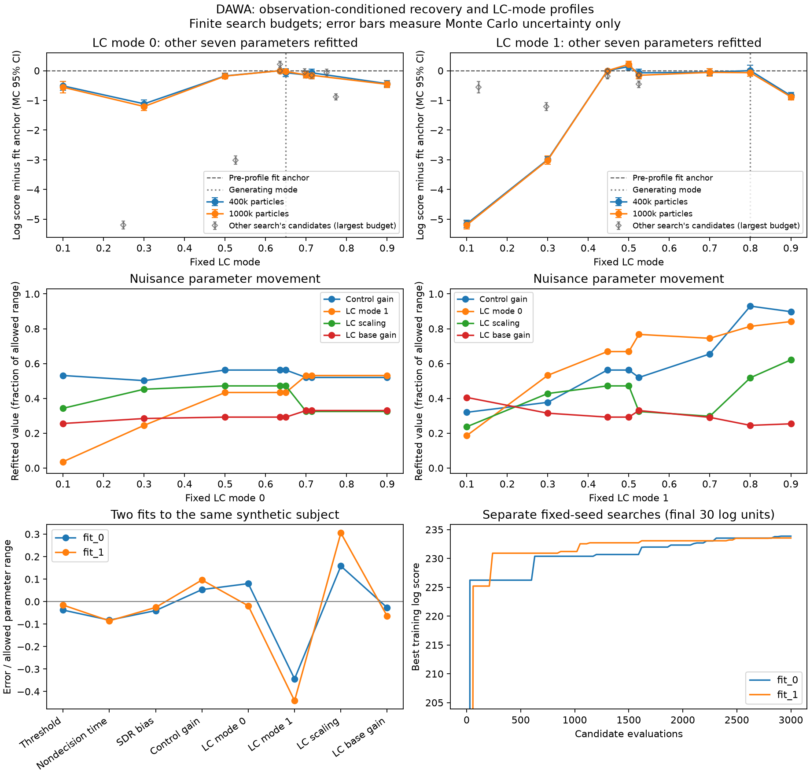

# Conditioned recovery and LC-mode profiles

This pilot follows the [particle accuracy study](CONDITIONED_ACCURACY.md).
It fits one synthetic subject from two starting points, then fixes each LC mode
over a broad range and refits the other seven parameters. Fresh-seed rescoring
separates Monte Carlo variation from differences between the resulting fits.
One subject cannot establish recovery across people or generating parameters.

Both H100 fits, all 16 profile searches, and all 352 final validation evaluations
are complete. Broadly different LC coordinates remain competitive at one
million particles, supporting **weak practical identification on this subject**.
The searches also leave measurable optimization error; these curves are not
certified profile maxima or parameter confidence intervals.

The [compact results](pec_recovery/conditioned_h100_pilot.json) retain parameter
vectors, all replicate score matrices, budget comparisons, and provenance.
The figure is available as [PNG](pec_recovery/conditioned_h100_pilot.png) or
[PDF](pec_recovery/conditioned_h100_pilot.pdf). Raw histories and observations
remain outside the repository.

## Completed fits

| Parameter | Generating value | Fit 0 | Fit 1 |
| --- | ---: | ---: | ---: |
| Response threshold | 0.400 | 0.383 | 0.393 |
| Nondecision time, s | 0.2200 | 0.2035 | 0.2029 |
| SDR bias | −0.400 | −0.420 | −0.413 |
| Control gain | 12.00 | 12.80 | 13.44 |
| LC mode 0 | 0.650 | 0.714 | 0.635 |
| LC mode 1 | 0.800 | 0.525 | 0.447 |
| LC scaling | 1.500 | 1.974 | 2.415 |
| LC base gain | 5.500 | 5.311 | 5.047 |

Both fits completed 3,000 proposals. Search time was **35.94 and 34.53 minutes**;
total time including generation, setup, independent validation, and predictive
summaries was **38.15 and 36.80 minutes**. There were 23 and 18 explicitly
rejected proposals (0.77% and 0.60%). All final rescoring runs passed strict
truncation checks. The last quarter of the searches improved training scores
by 0.838 and 0.482 log units; optimizer convergence is not established.

At one million particles across five fresh seeds:

| Candidate | Mean selected log score | Single-evaluation SD | Mean improvement over generating values (MC 95% interval) |
| --- | ---: | ---: | --- |
| Generating values | 229.065 | 0.174 | — |
| Fit 0 | 233.406 | 0.178 | +4.341 [4.188, 4.495] |
| Fit 1 | 233.627 | 0.194 | +4.562 [4.425, 4.699] |

Fit 1 beats fit 0 by 0.221 log units, with paired interval [0.147, 0.295].
The fixed-seed training scores had ranked them in the opposite order. This is
a concrete reason to validate finalists independently. Fit 1 becomes the
pre-profile anchor; profile validation uses a further independent seed set.

The fits depart from the generating LC coordinates while reliably improving
the score on this finite subject. That does not establish a recovery bug:
finite data can favor parameters other than those that generated it. The two
fits also have nearly equal mode contrasts (mode 1 minus mode 0: −0.189 and
−0.188), despite different mode levels, scaling, and base gain. The generating
contrast is +0.150. Profiles are needed to assess which combinations are
actually constrained; agreement between these two fits alone is insufficient.

## LC-mode profiles and numerical precision

Each mode has eight fixed values with 600 nuisance-search evaluations per value:
9,600 proposals in total. Searches took 44.34 and 45.49 minutes, or 57.08 and
58.18 minutes including preparation and validation, on separate H100s. One
mode-1 search proposal was explicitly penalized for truncation. All 352 final
validation evaluations passed strict checks.

Below are selected score differences from fit 1 at one million particles,
averaged over eight independent seeds. Intervals describe Monte Carlo mean
uncertainty on the same observations.

| Fixed parameter | Value | Mean score difference | Pointwise MC 95% interval |
| --- | ---: | ---: | --- |
| Mode 0 | 0.100 | −0.556 | [−0.752, −0.361] |
| Mode 0 | 0.300 | −1.205 | [−1.339, −1.071] |
| Mode 0 | 0.500 | −0.182 | [−0.279, −0.085] |
| Mode 0 | 0.650, generating value | −0.027 | [−0.093, +0.038] |
| Mode 0 | 0.900 | −0.459 | [−0.572, −0.346] |
| Mode 1 | 0.100 | −5.195 | [−5.328, −5.062] |
| Mode 1 | 0.300 | −3.011 | [−3.156, −2.866] |
| Mode 1 | 0.500 | +0.213 | [+0.105, +0.321] |
| Mode 1 | 0.700 | −0.056 | [−0.181, +0.068] |
| Mode 1 | 0.800, generating value | −0.066 | [−0.183, +0.051] |
| Mode 1 | 0.900 | −0.881 | [−0.987, −0.774] |

All eight tested mode-0 coordinates across 0.1–0.9 are within 1.21 log units
of the anchor. Mode-1 coordinates 0.447–0.8 are particularly competitive. Small
score preferences can be distinguishable numerically while providing little
constraint on the parameter over a broad range. More particles improve the
precision of those preferences; they do not add behavioral observations.

The mode-1 = 0.8 candidate illustrates compensation. Relative to fit 1, its
control gain changes from 13.44 to 18.95, LC scaling from 2.415 to 2.555, base
gain from 5.047 to 4.715, and mode 0 from 0.635 to 0.751. Its score is only
0.066 lower on average. Its mode contrast is **+0.049**, compared with −0.188
for fit 1. The negative contrast shared by the initial fits is therefore not
a stable identification result on this dataset.



Colored curves show the fixed-grid searches; connecting lines only guide the
eye. Gray diamonds show candidates from the other mode's search, placed at
their actual coordinates and evaluated at one million particles. They are
feasible candidates, not maxima for that coordinate. The middle row shows four
of the seven reoptimized nuisance coordinates; every full vector is in the JSON.

### Search limitations

The mode-1 = 0.5 candidate exceeds the free-fit anchor by 0.213 log units on
fresh seeds. It also has mode 0 = 0.635, exactly the same fixed value as a
mode-0 profile point that returned the anchor. This directly exposes unfinished
nuisance optimization. In addition, the other search found candidates at mode 1
= 0.129 and 0.296 with deficits of only 0.556 and 1.205, respectively. These are
near, but not equal to, the poorer mode-1 grid points at 0.1 and 0.3. Their gaps
cannot be interpreted as established sharp likelihood boundaries.

The largest last-quarter search improvement was 0.736 log units; the generating
mode-1 point improved by 0.612 during its last quarter. These searches need
better cross-starts and local refinement before interpreting detailed curvature
or excluding parameter regions. The broad competitive candidates themselves
remain informative even though the maxima are unfinished.

### Particle-budget agreement

The largest absolute change in a **mean candidate-minus-anchor comparison**
between 400k and one million particles is 0.090 log units. The main shape and
the broad competitive regions persist. Some pointwise drift intervals still
extend beyond ±0.2, so this does not establish uniform accuracy at that margin.
Nor does comparison with one million particles establish that reference's own
accuracy.

At the anchor, single-evaluation score SD is 0.188 at 400k and 0.153 at one
million. Across all candidates and seeds, minimum trial ESS is approximately
37 at 400k and 188 at one million. Two retained observations have posterior
contamination responsibility above one half in these evaluations. These support
diagnostics describe the declared mixture model; high ESS alone is not a
guarantee of good model support.

The next priority is to reuse candidates across both profile searches and add
targeted nuisance refinement, then repeat recovery on several synthetic subjects
and generating vectors. A separate raw-observation comparison should assess
smoothing bias. Experimental-design changes should follow that broader evidence;
this one subject does not establish structural nonidentifiability.

## H100 timing check

Before fitting, the H100 evaluated the same eight empirical subject-1 candidates
and observations used by the local accuracy study, from an identical frozen
solver snapshot. These are medians amortized over batches of four, including
diagnostics and host transfer, excluding the first batch at each budget:

| Particles | RTX 2080 Ti, s/candidate | H100 NVL, s/candidate | Speedup |
| ---: | ---: | ---: | ---: |
| 100,000 | 1.326 | 0.557 | 2.38× |
| 1,000,000 | 13.002 | 4.804 | 2.71× |

The H100 timing check used three seeds versus twenty in the local accuracy
study. It measures two complete host/GPU systems, not an isolated device
microbenchmark. Runtime depends on the parameter proposals; these values are
not a substitute for the actual recovery search times. The timing workload uses
empirical observations; the recovery experiment below uses a synthetic subject.

## The synthetic observation law

The recovery driver now defaults to generating observations under the same
law as the conditioned scoring kernel. It first generates a complete physical
history using the original nonlinear composition, with noise SD 0.1 in every
LCA. A separate observation seed then samples recorded choice/RT bins from
the source-normalized Gaussian kernel and uniform contamination mixture.
Recorded RTs use bin centers; the likelihood treats all values in a bin alike.
The underlying 10 ms LCA updates and LC clock are unchanged.

Measurement noise is applied **after the complete latent history**. It never
changes physical control state or simulated trial duration. The fitter sees
only the resulting recorded observations; it infers latent state through the
particle filter. Both latent and recorded synthetic CSVs are saved separately.
No empirical choices or RTs enter synthetic generation.

Matching the observation law isolates the behavior of the filter and optimizer.
It does not measure bias from applying a smoothed likelihood to raw physical or
empirical RTs. That requires a separate raw-observation recovery comparison.

The settings are 100 RT bins over 0–3 seconds, sigma 0.5 bins, and contamination
probability `200 / 100200` (about 0.2%). Pseudocounts scale with particle count to
preserve this probability during validation. An out-of-domain latent outcome
raises an error: the generator does not clip it, discard its trial, or silently
resample a different history. This pilot's generated history is in range; the
scoring kernel still retains implicit overflow probability for simulated paths.

`--observation-model auto` selects this law for conditioned recovery and raw
latent outputs for legacy marginal recovery. `--observation-model latent`
explicitly restores the earlier conditioned-recovery generation behavior, which
does not match the smoothed observation law. Empirical fitting is unaffected.

## Protocol

Both fits use the same subject-1 input design: 760 retained trials, 720 scored.
All retained observations, including the 40 history-only rows, condition state.
Generating values appear in the fit table above. Mode 0 and mode 1 refer to
previous-congruency levels 0 and 1.

Generation seed is 20261001, observation seed 20261002, and model construction
seed 29. Two separate H100 NVL GPUs run 3,000 CMA-ES proposals each, with
100,000 particles and population ten. Starts 0/1 use optimizer seeds 101/202
and fitting seeds 29/37. Differences between runs therefore cannot be attributed
solely to the starting point. Strict truncation checks use a 4,000-pass cap;
invalid proposals receive an explicit penalty and are recorded.

Final fitted, initial, and generating vectors are independently rescored at
one million particles with seeds 11001–11005. The stronger fitted vector by
this pre-profile validation defines a fixed comparison anchor for both profiles.

Each mode profile includes 0.1, 0.3, 0.5, 0.7, and 0.9, augmented by its
generating and fitted values. Each point gets 600 candidate evaluations at
100,000 particles. The other seven coordinates remain free on their original
grids. Initial nuisance candidates come from both fits, the generating vector,
and the nearest completed profile point. Profile training seed 17001 is fresh;
it is shared across fixed values. The fitted modes are included to make it
possible to detect improvement beyond the original fit anchor.

All frozen profile candidates, both fitted vectors, and the generating vector
are then evaluated at 400,000 and one million particles with eight fresh seeds,
18001–18008. Each repetition is a complete sequential filter. Log scores are
summed in host FP64 from the returned FP32 densities. Candidate contrasts pair
the same seeds; no per-trial factors are pooled across independent filters.

These are finite-budget profiles, not certified maxima. A profile that improves
on the free-fit anchor identifies unfinished optimization. Broad competitive
regions after refitting would support weak practical identification on this
dataset; they would not prove structural nonidentifiability. Pointwise 95%
intervals quantify uncertainty in Monte Carlo mean comparisons, not parameter
confidence intervals or uncertainty across synthetic subjects.

## Reproduction

The isolated source, launchers, observations, evaluation histories, and raw
results are stored on `della-rse` under:

```text
/scratch/gpfs/CSES/dmturner/dawa-benchmarks/conditioned-pilot-20260927
```

The source is based on `2f2f0c778f`, with the accuracy helpers, matched-observation
generation, and profile runner added. Manifests record source and input hashes.
Use a configured CUDA Python environment and separate output directories:

```bash
python Scripts/Debug/pec_batch_compile/dawa/dawa_pec_recovery.py \
  --likelihood conditioned --observation-model conditioned \
  --data-seed 20261001 --observation-seed 20261002 --model-seed 29 \
  --estimates 100000 --evaluations 3000 --population 10 --max-steps 4000 \
  --start 0 --optimizer-seed 101 --simulation-seed 29 \
  --optimizer-storage memory --predictive-estimates 256 \
  --validation-estimates 1000000 --validation-seeds 11001 11002 11003 11004 11005 \
  --output /tmp/dawa-conditioned-fit0
```

Repeat with start 1, optimizer seed 202, simulation seed 37, and a new output
directory. Then profile each mode with the [profile runner](dawa_conditioned_profile.py):

```bash
python Scripts/Debug/pec_batch_compile/dawa/dawa_conditioned_profile.py \
  --runs /tmp/dawa-conditioned-fit0 /tmp/dawa-conditioned-fit1 \
  --mode-index 0 --values .1 .3 .5 .7 .9 \
  --evaluations 600 --population 10 --estimates 100000 \
  --fit-seed 17001 --optimizer-seed 601 \
  --validation-estimates 400000 1000000 \
  --validation-seeds 18001 18002 18003 18004 18005 18006 18007 18008 \
  --output /tmp/dawa-conditioned-profile0
```

Use mode index 1 and optimizer seed 701 for the second profile. `--resume`
reuses completed points and complete validation batches after checking sources,
configuration, and environment. An interrupted unfinished point restarts its
search. The recovery driver itself does not resume interrupted optimization.

## Checks

The observation-generation test compares empirical frequencies with independently
computed kernel probabilities at the RT-domain boundary, including choice
contamination. It also checks latent-history preservation and invariance when
the pseudocount and particle count scale together. Out-of-domain histories and
reused observation seeds are explicitly rejected.

An analytic compensation-ridge test verifies that the profile optimizer holds
its selected coordinate fixed while optimizing every nuisance coordinate.
Profile values deduplicate by grid index, avoiding duplicate validation labels
from floating-point aliases. Report tests check seed pairing, particle-budget
contrasts, rejection of incomplete/duplicate records, and timing-source parity.

The empirical/recovery GPU CLI checks, a complete small GPU profile, and a
completed-profile restart check passed. Both full H100 fits verified exact
generator-versus-PEC replay at the generating seed. These checks complement,
rather than replace, the independent likelihood references in the accuracy study.
An independent audit checked all 9,600 profile proposals, fixed coordinates,
all 44 paired intervals, identical baseline scores across the two profiles,
and every recorded source hash against the current files. Ruff and
`git diff --check` passed.
