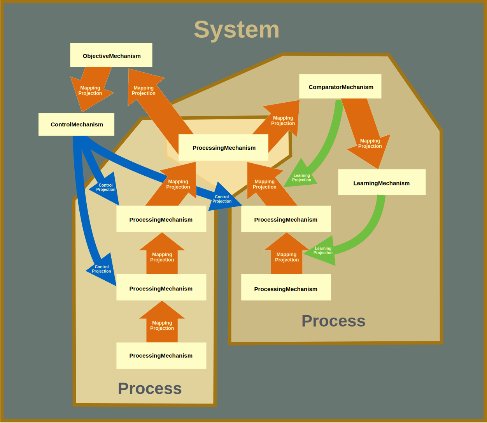

Basics and Sampler
==================

* `Basics`
* `Sampler`
    * `Simple_Configurations`
    * `Elaborate_Configurations`
    * `Dynamics_of_Execution`

.. _Basics:

Basics
------

PsyNeuLink models are made of `Components <Component>` and `Compositions <Composition>`:
Components are objects that perform a specific function, and Compositions are used to combine Components into an
executable model.  There are two primary kinds of Components:  `Mechanisms <Mechanism>` and `Projections <Projection>`.
For those familiar with block modeling systems, Mechanisms are the "blocks" in PsyNeuLink, and Projections are the
"links".  Mechanisms take inputs, use a function to process them in some way, and generate outputs that can be sent to
other Mechanisms. Projections are used to send information from one Mechanism to another.  A `Composition` uses
Projections to link Mechanisms together into pathways that can execute a Process, and Processes can be combined into
Systems to form networks or circuits that make up a systems-level model (see `figure <BasicsSampler_Overview_Figure>`
below).  A `Scheduler` coordinates the execution of Mechanisms in a Composition, each of which can be assigned one
or more pre-specified or customized `Conditions <Condition>`.

.. _BasicsSampler_Overview_Figure:

    **Figure**: Overview of the constituents of a PsyNeuLink model

Mechanisms and Projections fall into two broad categories:  ones that *directly transmit and transform* information,
taking the inputs to a model and generating its outputs;  and ones that *modulate* the transmission and transformation
of information.  PsyNeuLink provides a library of Components of each type.  For example, there is a variety of
ProcessingMechanisms that can be used to transform, integrate, and evaluate information; and there are
LearningMechanisms, ControlMechanisms, and GatingMechanism that can be used to modulate those processes.

Since Mechanisms can implement any function, Projections ensure that they can "communicate" with each other
seamlessly.  A Scheduler, together with Conditions, can be used to specify any pattern of execution among the
Mechanisms in a Composition.  Together, these allow PsyNeuLink to integrate Mechanisms of different types, levels of
analysis, and/or time scales of operation, composing heterogeneous Components into a single integrated system.  This
affords modelers the flexibility to commit each Component of their model to a form of processing and/or level of
analysis that is appropriate for that Component, while providing the opportunity to test and explore how they
interact with one another in a single system.

.. _Sampler:

Sampler
-------

.. _Simple_Configurations:

Simple Configurations
~~~~~~~~~~~~~~~~~~~~~

Mechanisms can be executed on their own (to gain familiarity with their functions), linked in simple configurations
(for testing isolated interactions), or in Compositions to implement a full model.
Linking Mechanisms for execution can be as simple as placing them in a list -- PsyNeuLink provides the necessary
Projections that connects each to the next one in the list.  For example, the following script uses a simple form of
Composition -- a `Process` -- to create a 3-layered 5-2-5 encoder network, the first layer of which uses a Linear
function (the default for a TransferMechanism), and the other two of which use a LogisticFunction::

    input_layer = TransferMechanism(size=5)
    hidden_layer = TransferMechanism(size=2, function=Logistic)
    output_layer = TransferMechanism(size=5, function=Logistic)
    my_encoder = process(pathway=[input_layer, hidden_layer, output_layer])

Each of the Mechanisms can be executed individually, by simply calling its `execute <Mechanism_Base.execute>` method
with an input array::

    output_layer.execute([0, 2.5, 10.9, 2, 7.6])

The full Process can be run simply by calling its `execute <Process_Base.execute>` method::

    my_encoder.execute([0, 2.5, 10.9, 2, 7.6])

The order of that the Mechanisms appear in the list determines the order of their Projections, and PsyNeuLink
picks sensible defaults when necessary Components are not specified.  In the example above, since no Projections were
specified, PsyNeuLink automatically created ones that were properly sized to connect each pair of Mechanisms,
using random initial weights.  However, it is easy to specify them explicitly, simply by inserting them in between
the Mechanisms in the pathway for the Process::

    my_projection_1 = MappingProjection(matrix=(.2 * np.random.rand(2, 5)) - .1))
    my_encoder = process(pathway=[input_layer, my_projection_1, hidden_layer, output_layer])

The first line above creates a Projection with a 2x5 matrix of random weights constrained to be between -.1 and +.1,
which is then inserted in the pathway between the ``input_layer`` and ``output_layer``.  The matrix itself could also
have been inserted directly, as follows::

    my_encoder = process(pathway=[input_layer, (.2 * np.random.rand(2, 5)) - .1)), hidden_layer, output_layer])

PsyNeuLink knows to create a MappingProjection using the matrix.  PsyNeuLink is also flexible.  For example,
a recurrent Projection from the ``output_layer`` back to the ``hidden_layer`` can be added simply by adding another
entry to the pathway::

    my_encoder = process(pathway=[input_layer, hidden_layer, output_layer, hidden_layer])

This tells PsyNeuLink to create a Projection from the output_layer back to the hidden_layer.  The same could have also
been accomplished by explicitly creating the recurrent connection::

    my_encoder = process(pathway=[input_layer, hidden_layer, output_layer])
    MappingProjection(sender=output_layer,
                      receiver=hidden_layer)

.. _Elaborate_Configurations:

More Elaborate Configurations
~~~~~~~~~~~~~~~~~~~~~~~~~~~~~

Configuring more complex features is just as simple and flexible.  For example, the feedforward network above can be
trained using backpropagation simply by adding an argument to the constructor for the Process::

    my_encoder = process(pathway=[input_layer, hidden_layer, output_layer], learning=ENABLED)

and then specifying the target for each trial when it is executed (here, the Process' `run <Process_Base.run>` command
is used to execute a series of trials, and five trials of inputs and targets are specified)::

    my_encoder.run(input=[[0, 0, 0, 0, 0],[1, 0, 0, 0, 0], [0, 0, 1, 0, 0], [0, 0, 0, 1, 0], [0, 0, 0, 0, 1]],
                   target=[[0, 0, 0, 0, 0],[1, 0, 0, 0, 0], [0, 0, 1, 0, 0], [0, 0, 0, 1, 0], [0, 0, 0, 0, 1]])

`Backpropagation <BackPropagation>` is the default learning method, but PsyNeuLink also currently supports
`Reinforcement Learning <Reinforcement>`, and others are currently being implemented (including Hebbian, Temporal
Differences, and supervised learning for recurrent networks).

PsyNeuLink can also be used to construct models with different kinds of Mechanisms.  For example, the script below
uses a `System` -- a more powerful form of Composition -- to create two feedforward networks that converge on a single
output layer, which combines the inputs and projects to a drift diffusion mechanism (DDM) that decides the response::

    colors_input_layer = TransferMechanism(size=2, function=Logistic, name='COLORS INPUT')
    words_input_layer = TransferMechanism(size=2, function=Logistic, name='WORDS INPUT')
    differencing_weights = np.array([[1], [-1]])
    output_layer = TransferMechanism(size=1, name='OUTPUT')
    decision_mech = DDM(name='DECISION')
    colors_process = process(pathway=[colors_input_layer, differencing_weights, output_layer])
    words_process = process(pathway=[words_input_layer, differencing_weights, output_layer])
    decision_process = process(pathway=[output_layer, decision_mech])
    my_simple_Stroop = system(processes=[colors_process, words_process, decision_process])

As a Composition get more complex, it helps to visualize it.  PsyNeuLink has built-in methods for doing so.
For example, calling ``my_simple_Stroop.show_graph()`` produces the following display:

.. _Simple_Stroop_Example_Figure:

**Composition Graph**

.. figure:: _static/Simple_Stroop_Example_fig.svg

   Graph representation of the Composition in the example above.

As the name of the ``show_graph()`` method suggests, Compositions are represented in PsyNeuLink as graphs, using a
standard dependency dictionary format, so that they can also be submitted to other graph theoretic packages for
display and/or analysis (such as `NetworkX <https://networkx.github.io>`_ and `igraph <http://igraph.org/redirect
.html>`_).

.. _Dynamics_of_Execution:

Dynamics of Execution
~~~~~~~~~~~~~~~~~~~~~

Finally, perhaps the most powerful feature of PsyNeuLink is its ability to simulate models with Components
that execute at arbitrary and disparate "time scales". For example, a Composition can include some Mechanisms
that require fine-grained updates (e.g., Euler integration of a drift diffusion process) with ones that carry out
"single shot" computations (e.g., a single pass through a feedforward neural network). By default, when a Composition
is run, each Component in it is executed at least once.  However, PsyNeuLink has a `Scheduler` that can be used to
design more complex dynamics of execution by assigning one or more `Conditions` to any Mechanism. Conditions can
specify the isolated behavior of a Mechanism (e.g., how many times it should be executed in each
`round of execution <LINK>`), or its behavior relative to that of one or more other Components (e.g., how many times
it should execute or when it should stop executing relative to other Mechanisms).

For example, the following script implements a Composition that integrates a 3-layered feedforward network for
performing a simple stimulus-response mapping task, with a recurrent network that receives input from and feeds back
to the feed-forward network, to provide a simple form of maintained context.  To allow the recurrent layer to settle
following the presentation of each stimulus (which is not required for the feedforward network), the Scheduler can
be used to execute the recurrent layer multiple times but the feedforward network only once in each round execution,
as follows::

    input_layer = TransferMechanism(size = 10)
    hidden_layer = TransferMechanism(size = 100)
    output_layer = TransferMechanism(size = 10)
    recurrent_layer = RecurrentTransferMechanism(size = 10)

    feed_forward_network = process(pathway=[input_layer, hidden_layer, output_layer])
    recurrent_network = process(pathway=[hidden_layer, recurrent_layer, hidden_layer])
    full_model = system(processes=[feed_forward_network, recurrent_network])

    my_scheduler = Scheduler(system=full_model)

    my_scheduler.add_condition(
        my_hidden_layer,
        Any(
            EveryNCalls(my_input_layer, 1),
            EveryNCalls(my_recurrent_layer, 10)
        )
    )
    my_scheduler.add_condition(
        my_output_layer,
        EveryNCalls(my_hidden_layer, 2)
    )

The two Conditions added to the controller specify that:

   1. ``my_hidden_layer`` should execute whenever either ``input_hidden_layer`` has executed once (to encode the stimulus and make available to the ``recurrent_layer``), or when the ``recurrent_layer`` has executed 10 times (to allow it to settle on a context representation and provide that back to the ``hidden_layer``)

   2. the ``output_layer`` should execute only after the ``hidden_layer`` has executed twice (to integrate its inputs from both ``input_layer`` and ``recurrent_layer``).

More sophisticated Conditions can also be created.  For example, the ``recurrent_layer`` can be scheduled to
execute until the change in its value falls below a specified threshold as follows::

    def converge(mech, thresh):
        for val in mech.delta:
            if abs(val) >= thresh:
                return False
        return True
    epsilon = 0.01

    my_scheduler.add_condition(
        my_hidden_layer,
        Any(
            EveryNCalls(my_input_layer, 1),
            EveryNCalls(my_recurrent_layer, 1)
        )
    )
    my_scheduler.add_condition(
        my_recurrent_layer,
        All(
            EveryNCalls(my_hidden_layer, 1),
            WhileNot(converge, my_recurrent_mech, epsilon)
        )
    )

Here, the criterion for stopping execution is defined as a function (``converge``), that is used in a `WhileNot`
Condition.  Any arbitrary Conditions can be created and flexibly combined to construct virtually any schedule of
execution that is logically sensible.

The `User's Guide <UserGuide>` provides a more detailed review of PsyNeuLink's organization and capabilities,
and the `Tutorial` provides an interactive introduction to its use.