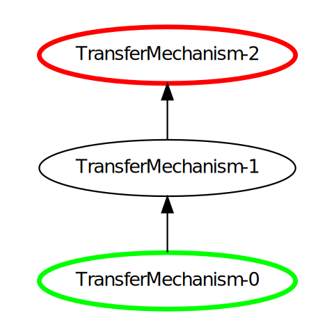
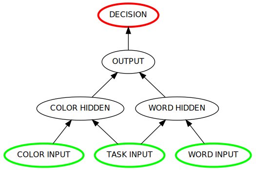
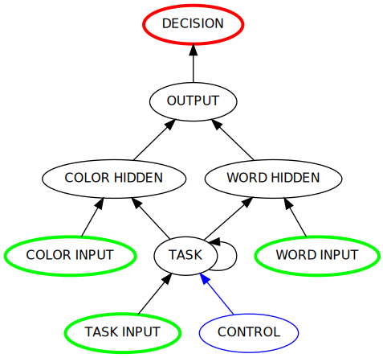

Basics and Sampler
==================

* `BasicsAndSampler_Basics`
* `BasicsAndSampler_Sampler`
    * `BasicsAndSampler_Simple_Configurations`
    * `BasicsAndSampler_Elaborate_Configurations`
    * `BasicsAndSampler_Dynamics_of_Execution`
    * `BasicsAndSampler_Control`
    * `BasicsAndSampler_Logging_and_Animation`
    * `BasicsAndSampler_Learning`

.. _BasicsAndSampler_Basics:

Basics
------

**Overview**

PsyNeuLink models are made up of `Components <Component>` and `Compositions <Composition>`:
Components are objects that perform a specific function, and Compositions are used to combine Components into a model.
There are two primary kinds of Components:  `Mechanisms <Mechanism>` and `Projections <Projection>`. For those
familiar with block modeling systems, Mechanisms are the "blocks" in PsyNeuLink, and Projections are the
"links".  Mechanisms take inputs, use a function to process them in some way, and generate outputs that can be sent to
other Mechanisms.  Projections allow the output of one Mechanism to be transmitted to another.  `Compositions` combine
these Components into pathways that constitute a `computational graph <https://en.wikipedia.org/wiki/Graph_
(abstract_data_type)>`_, in which the Mechanisms are nodes and Projections are directed edges. Compositions can also be
nodes, so that one Composition can be nested inside another to create more complex, hierarchical models (e.g., of
circuits or pathways within a larger system-level model). A `Scheduler` coordinates the execution of all of the
Components in a model.  By default, it executes them in the order determined by the Projections among the Mechanisms
and/or nested Compositions.  However, individual Components can be assigned one or more pre-specified or customized
`Conditions <Condition>` to handle more complex structures, such as feedback pathways, and/or the execution
of Components at different time scales (e.g., a recurrent network that needs time to settle before passing
information to a decision layer).

**Mechanisms and Projections**

Mechanisms and Projections fall into two broad categories:  `ProcessingMechanisms <ProcessingMechanism>`
*directly transmit* and possibly *transform* information, and are linked by `PathwayProjections
<PathwayProjection>` that transmit the information between them. *AdaptiveMechanisms <AdpativeMechanism>` *modify*
or *modulate* the transmission and transformation of information, by way of `ModulatoryProjections
<ModulatoryProjecdtion>` to the Components they modulate.  PsyNeuLink provides a library of Components of
each type.  For example, there is a variety of ProcessingMechanisms that can be used to transform, integrate, and
evaluate information in various ways (e.g., to implement layers of a feedforward or recurrent neural network, or a
drift diffusion decision process); and there are `ModulatoryMechanisms <ModulatoryMechanism>` and `LearningMechanisms
<LearningMechanism>` that can be used to modulate the functioning of ProcessingMechanisms and modify Projections,
respectively.  Since Mechanisms can implement any function, Projections ensure that they can "communicate" with
each other seamlessly.

Together, these elements allow PsyNeuLink to implement and integrate processes of different types, levels of analysis,
and/or time scales of operation, composing them into a coherent system.  This affords modelers the flexibility to
commit each part of their model to a form of processing and/or level of analysis that is appropriate for that part,
while providing the opportunity to test and explore how they interact with one another at the level of the entire
system.  The figure below provides an example of the kinds of elements available in PsyNeuLink, and some that are
planned for future inclusion.  The `QuickReference` provides a more detailed overview of PsyNeuLink objects and its
other facilities.  In the sections that follow, the Sampler provides some examples of how these are used to construct
models in PsyNeuLink.

.. _BasicsAndSampler_GrandView_Figure:

.. figure:: _static/BasicsAndSampler_GrandView_fig.svg

    **PsyNeuLink Environment.**  Full-colored items are examples of currently implemented elements; dimmed
    items are examples of elements planned for future implementation.

.. _BasicsAndSampler_Sampler:

Sampler
-------

The examples below are intended to provide a quick illustrations of some of PsyNeuLink's basic and more advanced
capabilities.  They assume some experience with computational modeling and/or relevant background knowledge.  The
`tutorial <>` provides additional introductory material for those who are newer to computational modeling, as well as a
more detailed and comprehensive introduction to the use of PsyNeuLink.

.. _BasicsAndSampler_Simple_Configurations:

Simple Configurations
~~~~~~~~~~~~~~~~~~~~~

Mechanisms can be executed on their own (to gain familiarity with their operation), or linked together and run
in a Composition to implement part of, or an entire model. Linking Mechanisms for execution can be as simple as
creating them and then assiging them to a Composition in a list -- PsyNeuLink provides the necessary Projections that
connects each to the next one in the list, making reasonable assumptions about their connectivity.  For example, the
following example creates a 3-layered 5-2-5 neural network encoder network, the first layer of which takes an an
array of length 5 as its input, and uses a `Linear` function (the default for a `TransferMechanism`), and the other
two of which take 1d arrays of the specified sizes and use a `Logistic` function::

    # Construct the Mechanisms:
    input_layer = ProcessingMechanism(size=5)
    hidden_layer = ProcessingMechanism(size=2, function=Logistic)
    output_layer = ProcessingMechanism(size=5, function=Logistic)

    # Construct the Composition:
    my_encoder = Composition()
    my_encoder.add_linear_processing_pathway([input_layer, hidden_layer, output_layer])

Each of the Mechanisms can be executed individually, by simply calling its `execute <Mechanism_Base.execute>` method
with an appropriately-sized input array, for example::

    output_layer.execute([0, 2.5, 10.9, 2, 7.6])
    >> array([[0.5, 0.92414182, 0.99998154, 0.88079708, 0.9994998 ]])

The Composition connects the Mechanisms into a pathway that form a graph, which can be shown using its `show_graph
<Composition.show_graph>` method:

.. _BasicsAndSampler_Simple_Pathway_Example_Figure:

   **Composition Graph.**  Representation of the graph of the simple Composition in the example above.  Note that the
   Input Mechanism for the Composition is colored green (to designate it is an `INPUT` node), and its output
   Mechanism is colored Red (to designate it at a `OUTPUT` node).

As the name of the ``show_graph()`` method suggests, Compositions are represented in PsyNeuLink as graphs, using a
standard dependency dictionary format, so that they can also be submitted to other graph theoretic packages for
display and/or analysis (such as `NetworkX <https://networkx.github.io>`_ and `igraph <http://igraph.org/redirect
.html>`_).  They can also be exported as a JSON file, in a format that is currently being developed for the exchange
of computational models in neuroscience and psychology (see `BIDS <XXX>`)

.. XXX USE show_graph(show_node_structure=True) HERE OR ABOVE::

The Composition can be run by calling its `run <Composition.run>` method, with an input array appropriately sized for
the first Mechanism in the pathway (in this case, the input_layer)::

    my_encoder.run([1, 4.7, 3.2, 6, 2])
    [array([0.88079707, 0.88079707, 0.88079707, 0.88079707, 0.88079707])]

The order in which Mechanisms appear in the list of the `add_linear_pathway <Composition.add_linear_pathway>`
method determines their order in the pathway.  More complicated arrangements can be created by adding nodes
individually using a Composition's `add_nodes <Composition.add_nodes>` method, and/or by creating intersecting
pathways, as shown in some of the examples further below.

PsyNeuLink picks sensible defaults when necessary Components are not specified.  In the example above no `Projections
<Projection>` were actually specified, so PsyNeuLink automatically created the appropriate types (in this case,
`MappingProjections<MappingProjection>`), and sized them appropriately to connect each pair of Mechanisms. Each
Projection has a `matrix <Projection.matrix>` parameter that weights the connections between the elements of the output
of its `sender <Projection.sender>` and those of the input to its `receiver <Projection.receiver>`.  Here, the
default is to use a `FULL_CONNECTIVIT_MATRIX`, that connects every element of the sender's array to every element of
the receiver's array weight of 1 (a ). However, it is easy to specify a Projection explicitly, including its matrix,
simply by inserting them in between the Mechanisms in the pathway::

    my_projection = MappingProjection(matrix=(.2 * np.random.rand(2, 5)) - .1))
    my_encoder = Composition()
    my_encoder.add_linear_processing_pathway([input_layer, my_projection, hidden_layer, output_layer])

The first line above creates a Projection with a 2x5 matrix of random weights constrained to be between -.1 and +.1,
which is then inserted in the pathway between the ``input_layer`` and ``hiddeen_layer``.  The matrix itself could also
have been inserted directly, as follows::

    my_encoder.add_linear_processing_pathway([input_layer, (.2 * np.random.rand(2, 5)) - .1)), hidden_layer, output_layer])

PsyNeuLink knows to create a MappingProjection using the matrix.  PsyNeuLink is also flexible.  For example,
a recurrent Projection from the ``output_layer`` back to the ``hidden_layer`` can be added simply by adding another
entry to the pathway::

    my_encoder.add_linear_processing_pathway([input_layer, hidden_layer, output_layer, hidden_layer])

This tells PsyNeuLink to create a Projection from the output_layer back to the hidden_layer.  The same could have also
been accomplished by explicitly creating the recurrent connection::

    my_encoder.add_linear_processing_pathway([input_layer, hidden_layer, output_layer])
    recurent_projection = MappingProjection(sender=output_layer,
                      receiver=hidden_layer)
    my_encoder.add_projection(recurent_projection)

.. _BasicsAndSampler_Elaborate_Configurations:

More Elaborate Configurations
~~~~~~~~~~~~~~~~~~~~~~~~~~~~~

Configuring more complex models is also straightforward.  For example, the script below implements a model of the
`Stroop task <https://en.wikipedia.org/wiki/Stroop_effect>`_ by creating two feedforward neural network pathways
-- one for color naming and another for word reading -- as well as a corresponding pair of pathways that determine which
of those to perform based on a task instruction. These all converge on a common output mechanism that projects to a
drift diffusion (DDM) decision mechanism responsible for determining the response::

    # Construct the color naming pathway:
    color_input = ProcessingMechanism(name='COLOR INPUT', size=2) # note: default function is Linear
    color_input_to_hidden_wts = np.array([[1, -1], [-1, 1]])
    color_hidden = ProcessingMechanism(name='COLOR HIDDEN', size=2, function=Logistic(bias=-4))
    color_hidden_to_output_wts = np.array([[1, -1], [-1, 1]])
    output = ProcessingMechanism(name='OUTPUT', size=2 , function=Logistic)
    color_pathway = [color_input, color_input_to_hidden_wts, color_hidden, color_hidden_to_output_wts, output]

    # Construct the word reading pathway (using the same output_layer)
    word_input = ProcessingMechanism(name='WORD INPUT', size=2)
    word_input_to_hidden_wts = np.array([[2, -2], [-2, 2]])
    word_hidden = ProcessingMechanism(name='WORD HIDDEN', size=2, function=Logistic(bias=-4))
    word_hidden_to_output_wts = np.array([[2, -2], [-2, 2]])
    word_pathway = [word_input, word_input_to_hidden_wts, word_hidden, word_hidden_to_output_wts, output]

    # Construct the task specification pathways
    task_input = ProcessingMechanism(name='TASK INPUT', size=2)
    task_color_wts = np.array([[4,4],[0,0]])
    task_word_wts = np.array([[0,0],[4,4]])
    task_color_pathway = [task_input, task_color_wts, color_hidden]
    task_word_pathway = [task_input, task_word_wts, word_hidden]

    # Construct the decision pathway:
    decision = DDM(name='DECISION', input_format=ARRAY)
    decision_pathway = [output, decision]

    # Construct the Composition:
    Stroop_model = Composition(name='Stroop Model')
    Stroop_model.add_linear_processing_pathway(color_pathway)
    Stroop_model.add_linear_processing_pathway(word_pathway)
    Stroop_model.add_linear_processing_pathway(task_color_pathway)
    Stroop_model.add_linear_processing_pathway(task_word_pathway)
    Stroop_model.add_linear_processing_pathway(decision_pathway)

This is a simplified version the model described in `Cohen et al. (1990) <https://www.researchgate
.net/publication/20956134_Cohen_JD_McClelland_JL_Dunbar_K_On_the_control_of_automatic_processes_a_parallel_distributed_processing_account_of_the_Stroop_effect_Psychol_Rev_97_332-361>`_,
a more complete version of which can be found in the `PsyNeuLink Library <https://princetonuniversity.github
.io/PsyNeuLink/Library.html>`_ at `Stroop Model <XXXX GET FROM Q>`.  The figure belows shows the model using the
Composition's `show_graph <Composition.show_graph>` method.

.. _BasicsAndSampler_Simple_Stroop_Example_Figure:

   **Stroop Model.** Representation of the Composition in the example above.

Running the model is as simple as generating some inputs and then providing them to the `run <Composition.run>`
method.  Inputs are specified in a dictionary, with one entry for each of the Composition's `INPUT`
Mechanisms;  each entry contains a list of the inputs for the specified Mechanism, one for each trial to be run.
The following defines two stimui to use as the color and word inputs (``red`` and ``green``, and two for use as the
task input (``color`` and ``word``), and then uses them to run the model for a color naming congruent trial, followed
by a color naming incongruent trial::

    red =   [1,0]
    green = [0,1]
    word =  [0,1]
    color = [1,0]
                                       # Trial 1  Trial 2
    Stroop_model.run(inputs={color_input:[red,     red   ],
                             word_input: [red,     green ],
                             task_input: [color,   color ]})
    print(Stroop_model.results)
    >> [[array([1.]), array([2.80488344])], [array([1.]), array([3.94471513])]]

When a Composition is run, its `results <Composition.results>` attribute stores the values of its `OUTPUT` Mechanisms
at the end of each `trial <TimeScale.TRIAL>`. In this case, the `DDM` Mechanism is the only `OUTPUT` Mechanism, and it
has two output values by default: the outcome of the decision (1 or -1, in this case corresponding to ``red`` or
``green``), and the estimated mean decision time for the decision (in seconds).  So, the value returned by the `results
<Composition.results>` attribute is a 3d array containing two 2d arrays, each of which has the two outputs of the DDM
for each `trial <TimeScale.TRIAL>` (notice that the estimated response time for the second, incongruent trial was
significantly longer than for the first, congruent trial;  note also that, on some executions it might return -1 as
the response in the second trials since, by default, the `function <DDM.function>` used for the decision process has
a non-zero `noise <DriftDiffusionAnalytical.noise>` term).

.. _BasicsAndSampler_Dynamics_of_Execution:

Dynamics of Execution
~~~~~~~~~~~~~~~~~~~~~

.. - Execute at multiple times scales:
..   • run DDM in integrator mode
..   • but notice that it only executes one step of integration
..   • so, can apply condition that causes it to execute until it "completes" which, for a DDM is when the process
..     the value specified in its threhosld parameter, as follows::

One of the most powerful features of PsyNeuLink is its ability to simulate models with Components that execute at
different time scales.  By default, each Mechanism executes once per pass through the Composition, in the order
determined by the projections between (and shown in the `show_graph <Composition.show_graph>` method.  In the
``Stroop_model`` above, the ``decison`` Mechanism executes once per pass, just after the ``ouput`` Mechanism.  This
is a `DDM` Mechanism, that uses `DriftDiffusionAnalytical` as its default `function <DDM.function>`, which computes an
analytic solution to the distribution of responses the DDM integration process (at a specified `threshold
<DriftDiffusionAnalytical.threshold>`), and returns both the probability of threshold crossing and the mean
crossing time.  However, it is also possible to simulate the dynamics of the integration process by assigning
`DriftDiffusionIntegrator` as the Mechanism's `function <DDM.function>` and specifying, in the call to the
Composition's `run <Composition.run>` method, that a `trial <TimeScale.TRIAL>` terminate only when the ``decision``
Mechanism has completed its execution, as follows::

    # Modify consruction of decision Mechanism:
    decision = DDM(name='DECISION',
                   input_format=ARRAY,
                   function=DriftDiffusionIntegrator(noise=0.5, threshold=20)
                   )
    Stroop_model.run(inputs={color_input:red, word_input:green, task_input:color},
                     termination_processing={TimeScale.TRIAL: WhenFinished(decision)}
                     )
    print (Stroop_model.results)
    >> [[array([[20.]]), array([[126.]])]]

The output is now the result of the `DriftDiffusionIntegrator`, which is the value of the decision variable when it
crosses threshold (which is, by definition, equal to either the postive or negative value of the `threshold
<DriftDiffusionAnalytical.threshold>`) and the number of executions it took to do so.  Since the ``decsion``
Mechanism is the last (`TERMINAL`) Mechanism of the Composition, it is also its `OUTPUT` Mechanism, and therefore it
output is recorded in the `results <Composition.results>` attribute of the Stroop model, as shown above (note: because
there is noise in the integration process, running the model several times produces varying response times).

This version of the model includes Mechanisms that execute over different time-scales:  the ProcessingMechanisms
completed their computations in a single execution, whereas the DDM took many executions to complete its computation.
In this case, the coordination of time scales was straightforward, since the DDM was the last Mechanism in the
Composition:  the ProcessingMechanisms in each pathway executed in sequence, ending in the DDM wich executed until
it was complete.  PsyNeuLink's `Scheduler` can also be used to implement more complicated dependencies among Mechanisms
that execute over different time scales, by assigning one or more `Conditions <Condition>` for execution of the
Mechanisms to the `Scheduler` for the Composition. Conditions can specify the isolated behavior of a Mechanism (e.g.,
how many times it should be executed in each `trial <TimeScale.TRIAL>`), its behavior relative to that of one or more
other Components (e.g., how many times it should wait for another Mechanism to execute before it does so), or even
arbitrary functions (e.g., a convergence criterion for the settling of a recurrent network). For example, the
following implements a verion of the model above that uses a leaky competing accumulator `<https://www.ncbi.nlm.nih
.gov/pubmed/11488378>`_ (`LCAMechanism`) for the ``task`` Mechanism, that settles for a specified number of executions
before the color and word hidden layers execute -- simulating a situation in which the task instruction is processed
before processing the color or word stimuli::

    # Modify consruction of task Mechanism:
    task = LCAMechanism(name='TASK', size=2)

    # Assign conditions to scheduler:
    Stroop_model.processing_scheduler.add_condition(color_hidden, EveryNExecutions(task, 10))
    Stroop_model.processing_scheduler.add_condition(word_hidden, EveryNExecutions(task, 10))

    # Run with scheduler:
    Stroop_model.run(inputs={color_input:red, word_input:green, task_input:color})
    print (Stroop_model.results)
    >>[[array([[20.]]), array([[42.]])]]

In the example above, the ``color_hidden`` and ``word_hidden`` Mechanisms both wait to execute until the ``task``
Mechanism has executed 100 times.  They could also each have been made to wait different number of times;  in that case,
since the ``output`` Mechanism depends on both them, it would have waited until they had both executed before doing so
itself.  This imposes a fixed "setting time" (100 executions) on the ``task`` Mechanism. However, it could also be
allowed to settle until it reaches some criterion.  For example, the ``color_hidden`` and ``word_hidden`` can be
configured to wait until the value of the ``task`` Mechanism "converges", by changing the conditions for execution
of the ``color_hidden`` and ``task_hidden`` Mechanism's to depend on a function, as follows::

    # Define a function that detects when the a Mechanism's value has converged, such that the change in all of the
    elements of its value attribute from the last execution (given by its delta attribute) falls below ``epsilon``

    def converge(mech, thresh):
        return all(abs(v) <= thresh for v in mech.delta)

    # Add Conditions to the ``color_hidden`` and ``word_hidden`` Mechanisms that depend on the converge function:
    epsilon = 0.01
    Stroop_model.processing_scheduler.add_condition(color_hidden, When(converge, task, epsilon)))
    Stroop_model.processing_scheduler.add_condition(word_hidden, When(converge, task, epsilon)))

Conditions can be made to depend on any Python function.  There is also a rich set of `pre-defined Conditions
<Condition_Pre-Specified_List>` (such as ``When`` in the examples above).  Together, these can be combined to
construct virtually any schedule of execution that is logically possible.

.. _BasicsAndSampler_Control:

Control
~~~~~~~

Another distinctive feature of PsyNeuLink is the ability to easily create models that include control;  that is,
Mechanisms that can evaluate the output of other Mechanisms (or nested Compositions), and use this to regulate the
processing of those Mechanisms.  For example, modifications of the ``Stroop_model`` shown below allow it to monitor
conflict in the ``output`` Mechanism on each `trial <TimeScale.TRIAL>`, and use that to regulate the gain of the
``task`` Mechanism::

    # Construct control mechanism
    control = ControlMechanism(name='CONTROL',
                               objective_mechanism=ObjectiveMechanism(name='Conflict Monitor',
                                                                      monitor=output
                                                                      function=Energy(size=2,
                                                                                      matrix=[[0,-2.5],[-2.5,0]])),
                               control_signals=[(GAIN, task)])

    # Construct the Composition using the control Mechanism as its controller:
    Stroop_model = Composition(name='Stroop Model', controller=control)

    # Print statements show state of
    np.set_printoptions(precision=2)
    t = 0
    def print_after():
        global t
        print(f'AFTER trial {t}:')
        print(f'\t\t\t\t  red\tgreen')
        print(f'\ttask:\t\t{task.value[0]}')
        print(f'\toutput:\t\t{output.value[0]}')
        print(f'\tdecision variable:\t{decision.variable}')
        print(f'\tdecision:\t{decision.value[0]}\t{decision.value[1]}')
        print(f'\tconflict:\t\t{control._objective_mechanism.value[0]}')
        print(f'\tcontrol:\t\t{control.control_signals[0].value}')
        t += 1

    # Set up run and then execute it
    task.initial_value = [0.5,0.5]      # Assign "neutral" starting point for task units on each trial
    task.reinitialize_when=AtPass(n=0)  # Reinitialize task units at beginning of each trial
    num_trials = 5
    stimuli = {color_input:[red]*num_trials,
               word_input:[green]*num_trials,
               task_input:[color]*num_trials}
    Stroop_model.run(inputs=stimuli, call_after_trial=print_after)

This example takes advantage of several additional features of PsyNeuLink, including its ability to automate certain
forms of construction, and perform specified operations at various points during execution (e.g., reinitialize variables
and call user-defined functions).  For example, the constructor for the ControlMechanism can be used to specify how
control should be configured, and automates the process of implementing it:  the **objective_mechanism** argument
specifies the construction of an ObjectiveMechanism for the ControlMechanism that provides its input, and
the **control_signals** argument specifies the parameters of the Mechanisms it should regulate and constructs the
`ControlProjections <ControlProjection>` that implement this.  Furthermore, the constructor for the
`ObjectiveMechanism` used in the **objective_mechanism** argument specifies that it should monitor the value of the
``output`` Mechanism, and use the `Energy` Function to evaluate it.  PsyNeuLink automatically constructs the
MappingProjections from ``output`` to the ObjectiveMechanism, and from the latter to the ControlMechanism.  The latter
is then added to the ``Stroop_model`` as its `controller <Composition .controller>` in its constructor.
The result is shown in the figure below, using the **show_controller** option of the Composition's `show_graph
<Composition.show_graph>` method:

.. _BasicsAndSampler_Stroop_Example_With_Control_Figure:

   **Stroop Model with Controller.** Representation of the Composition with the ``control`` Mechanism added, generated
   by a call to ``Stroop_model.show_graph(show_controller)``.

The ``task`` Mechanism is configured to reinitialize at the beginning of each `trial <TimeScale.TRIAL>`, and the
**call_after_trial** argument of the Composition's `run <Composition.run>` method is used to print Mechanism values
at the end of each `trial <TimeScale.TRIAL>` (see `below <Stroop_model_output>`).

When the Composition executes, the Objective Mechanism receives the output of the ``output`` Mechanism, and uses the
`Energy` function assigned to it to compute conflict in the ``output`` Mechanism (i.e., the degree of co-activity of
the ``red`` and ``green`` values).  The result passed to the ``control`` Mechanism, which uses it to set the `gain
<Logistic .gain>` of the ``task`` Mechanism's `Logistic` function.  The ``task`` Mechanism is configured to
reinitialize at the beginning of each `trial <TimeScale.TRIAL>`; and,since the ``control`` Mechanism was assigned as
the Composition's `controller <Composition.controller>`, it executes at the end of each `trial <TimeScale.TRIAL>`
after all of the other Mechanisms in the Composition have executed, which has its effects on the ``task`` Mechanism
the next time it executes (i.e., on the next `trial <TimeScale.TRIAL>`;  a Composition's `controller <Composition
.controller>` can also be configured to execute at the start of a `trial <TimeScale.TRIAL>`). Finally, the
**call_after_trial** argument of the Composition's `run <Composition.run>` method is used to print Mechanism values
at the end of each `trial <TimeScale.TRIAL>`. Running it for several `trials <TimeScale.TRIAL>` produces the
following output::

    .. _Stroop_model_output:

    End of trial 0:
                    color  word
        task:		[ 0.67  0.51]
        task gain:	   [ 0.5]
                    red   green
        output:		[ 0.28  0.72]
        decision:	[-1.][ 2.36]
        conflict:	  [ 0.51]

    End of trial 1:
                    color  word
        task:		[ 0.81  0.4 ]
        task gain:	   [ 0.51]
                    red   green
        output:		[ 0.38  0.62]
        decision:	[-1.][ 3.33]
        conflict:	  [ 0.59]

    End of trial 2:
                    color  word
        task:		[ 0.97  0.19]
        task gain:	   [ 0.59]
                    red   green
        output:		[ 0.55  0.45]
        decision:	[ 1.][ 3.97]
        conflict:	  [ 0.62]

    End of trial 3:
                    color  word
        task:		[ 1.    0.04]
        task gain:	   [ 0.62]
                    red   green
        output:		[ 0.65  0.35]
        decision:	[ 1.][ 2.95]
        conflict:	  [ 0.57]

The control

.. _BasicsAndSampler_Logging_and_Animation:

Logging and Animation
~~~~~~~~~~~~~~~~~~~~~

.. The **animate** argument of the `run <Composition.run>` method can be used to generate an animation of the
.. Composition's execution::
..
..     XXX ANIMATION EXAMPLE HERE

The print statements used in the example above illustrate the availability of "hooks" that can be used to carry out
custom operations at various points during execution (XXX OTHER HOOKS HERE).  However, PsyNeuLink also has powerful
logging capabilities that can be used to store and generate any parameter of a model standard forms (e.g, as numpy
arrays, in CSV format, or easy to read formats for console output, as shown below::

    XXX LOG EXAMPLE HERE

ControlMechanisms and ObjectiveMechanisms can also be manually configured, and added as free-standing nodes in
Composition (i.e., not necessarily as its `controller <Composition.controller>`.

.. XXX
.. • Explain:
..  - use call_after_trial to print stuff (and explain it as a hook), and then explain log (or use with print_entries??)
..  - special status of controller
.. • Replace figure once double projections to task unit are corrected
.. • Change names of:
..   - ``output`` Mechanism above to ``phonology``
..   - ``color_hidden`` to ``color``
..   - ``word_hidden`` to ``orthography``

A more elaborate example of this model can be found at `BotvinickConflictMonitoringModel`. More complicated forms of
control are also possible, for example, ones that run internal simulations to optimize the amount of control to
optimize some criterion (e.g,. maximize the `expected value of control <https://royalsocietypublishing
.org/doi/full/10.1098/rstb.2013.0478>`_ (see XXX EVC script), or to implement `model-based learning
<https://royalsocietypublishing.org/doi/full/10.1098/rstb.2013.0478>`_ (see XXX LVOC script).

.. XXX MENTION SPECIFIC EXAMPLE SCRIPTS/MODELS HERE

.. .. _BasicsAndSampler_Learning:
..
.. Learning
.. ~~~~~~~~
..
.. Impelements all major forms of learning (autoassociative, RL and BP)
.. Implementation favors modulariziation / depiction of process flow (pedagogical tool, e.g., animation - SHOW EXAMPLE)
.. But integrates PyTorch for efficiency and generality: Autodiff EXAMPLE (Rumelhart network)
..
.. OLD:
.. For example, the feedforward network above can be
.. trained using backpropagation simply by adding the **learning** argument to the constructor for the Process::
..
..     my_encoder = Process(pathway=[input_layer, hidden_layer, output_layer], learning=ENABLED)
..
.. and then specifying the target for each trial when it is executed (here, the Process' `run <Process.run>` command
.. is used to execute a series of five training trials, one that trains it on each element of the input)::
..
..     my_encoder.run(input=[[0,0,0,0,0], [1,0,0,0,0], [0,0,1,0,0], [0,0,0,1,0], [0,0,0,0,1]],
..                    target=[[0,0,0,0,0], [1,0,0,0,0], [0,0,1,0,0], [0,0,0,1,0], [0,0,0,0,1]])
..
.. `Backpropagation <BackPropagation>` is the default learning method, but PsyNeuLink also currently supports
.. `Reinforcement Learning <Reinforcement>`, and others are currently being implemented (including Hebbian, Temporal
.. Differences, and supervised learning for recurrent networks).
..
..
.. -----------------
..
.. STUFF TO ADD:
..
.. One of the most useful applications for PsyNeuLink is the design of models that include control processes.
.. XXX USER DEFINED FUNCTIONS
.. XXX CONTROL (STROOP)
.. XXX HETEROGENOUS TYPES: ADD DECISION MAKING USING DDM;  FitzHugh-Nagumo Mechanism
.. XXX LEARNING:  USING RL AND BP
.. XXX NESTED COMPOSITIONS: AUTODIFF
.. XXX COMPILATION
..
.. The `User's Guide <UserGuide>` provides a more detailed review of PsyNeuLink's organization and capabilities,
.. and the `Tutorial` provides an interactive introduction to its use.
