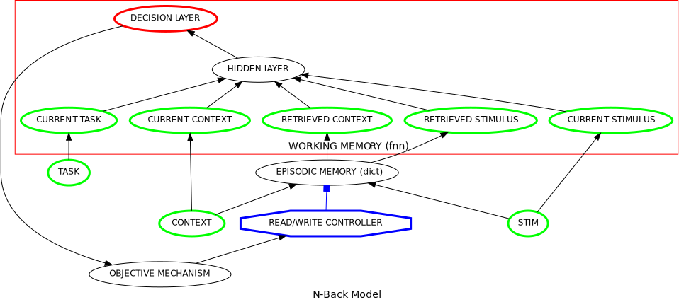

N-Back Model (Beukers et al., 2022)
==================================================================
`"When Working Memory is Just Working, Not Memory" <https://psyarxiv.com/jtw5p>`_

Overview
--------
This implements a model of the `N-back task <https://en.wikipedia.org/wiki/N-back#Neurobiology_of_n-back_task>`_
described in `Beukers et al. (2022) <https://psyarxiv.com/jtw5p>`_.  The model uses a simple implementation of episodic
memory (as a form of content-retrieval memory) to store previous stimuli and the temporal context in which they occured,
and a feedforward neural network to evaluate whether the current stimulus is a match to the n'th preceding stimulus
retrieved from episodic memory.

.. _nback_Fig:

The Model
---------

Network System
~~~~~~~~~~~~~~
**COLOR INPUT LAYER**:  a `TransferMechanism` with **size** = 3 (one unit for the input of one color, respectively
here blue & green), and assigned a `Linear` function with **slope** = 1.0 and **intercept** = 0.0.

**WORD INPUT LAYER**:  a `TransferMechanism` with **size** = 3 (one unit for the input of one word, respectively,
here blue & green), and assigned a `Linear` function with **slope** = 1.0 and **intercept** = 0.0.

**TASK INPUT LAYER**:  a `TransferMechanism` with **size** = 2 (one unit specified with a task
value of one, the other element set to zero), and assigned a `Linear` function with **slope** = 1.0 and **intercept** = 0.0.

**COLOR HIDDEN LAYER**: a `RecurrentTransferMechanism` with **size** = 3 (one element for each of the two colors, one
element for the neutral color and assigned a `Logistic` function with **gain** = 4.0 and **bias** = 1.0.
The **integrator_mode** = `True` and **smoothing_factor** = 0.01. Both units receive mutually inhibitory weights
(**hetero** = -2).

**WORD HIDDEN LAYER**: a `RecurrentTransferMechanism` with **size** = 3 (one element for each of the two colors, one
element for the neutral color and assigned a `Logistic` function with **gain** = 4.0 and **bias** = 1.0.
The **integrator_mode** = `True` and **smoothing_factor** = 0.01. Both units receive mutually inhibitory weights
(**hetero** = -2).

**TASK DEMAND LAYER**: a `RecurrentTransferMechanism` with **size** = 2 (one element for each of the two tasks, and
assigned a `Logistic` function with **gain** = 1.0 and **bias** = 0.0. The **integrator_mode** = `True`
and **smoothing_factor** = 0.01. Both units receive mutually inhibitory weights (**hetero** = -2).

**RESPONSE LAYER**: a `RecurrentTransferMechanism` with **size** = 2 (one element for each of the two responses, and
assigned a `Logistic` function with **gain** = 1.0 and **bias** = 0.0. The **integrator_mode** = `True`
and **smoothing_factor** = 0.01. Both units receive mutually inhibitory weights (**hetero** = -2).

**PROJECTIONS**:  The weights of the  network are implemented as `MappingProjections <MappingProjection>`.
The `matrix <MappingProjection.matrix>` parameter from the *COLOR INPUT_LAYER*, the *WORD INPUT_LAYER*, and the
*BIAS INPUT_LAYER* to the *COLOR HIDDEN LAYER* and *WORD HIDDEN LAYER* are all set with a numpy array with a value of
1.0 for the diagonal elements and all off-diagonal elements are set to 0.
The color hidden layer projects to the *TASK LAYER* with a numpy array with a value of 4.0 on the the first column, and
0.0 on the second column, and receive inputs from the *TASK LAYER* with a numpy array with a value of 4.0 on the first row
and a value of 0.0 in the second row.
The word hidden layer projects to the *TASK LAYER* with a numpy array with a value of 4.0 on the the second column, and
0.0 on the first column, and receive inputs from the *TASK LAYER* with a numpy array with a value of 4.0 on the second row
and a value of 0.0 in the first row.
The *RESPONSE LAYER* receives projections from two layers:
the *COLOR HIDDEN LAYER* with a numpy array with a value of 1.5 on the diagonal elements and 0.0 on the off-diagonal
elements.
The *WORD HIDDEN LAYER* with a numpy array with a value of 2.5 on the diagonal elements and 0.0 on the off-diagonal
elements.

Execution
---------
All units are set to zero at the beginning of the simulation. Each simulation run starts with a settling
period of 500 time steps. Then the stimulus is presented for 1000 time steps and is presented by setting the input
units to 1.0 for a given trial. Conflict is computed on the `output_port` of the *RESPONSE LAYER*. The figure plots
conflict over one trial for each of the three conditions.
The `log` function is used to record the output values of *RESPONSE LAYER*. These values are used to produce
the plot of the Figure.

Please note:
------------
Note that this script implements a slightly different Figure than in the original Figure in the paper.
However, this implementation is identical with a plot we created with an old MATLAB code which was used for the
conflict monitoring simulations.

Script: :download:`N-back.py <../../psyneulink/library/models/N-Back.py>`
