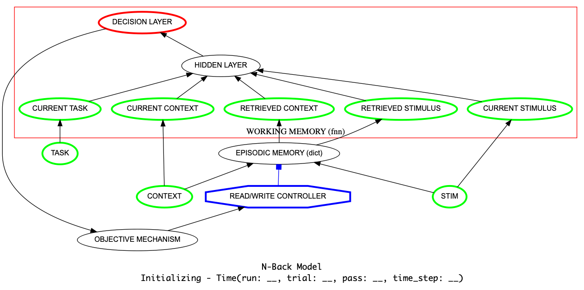

N-Back Model (Beukers et al., 2022)
==================================================================
`"When Working Memory is Just Working, Not Memory" <https://psyarxiv.com/jtw5p>`_

Overview
--------
This implements a model of the `N-back task <https://en.wikipedia.org/wiki/N-back#Neurobiology_of_n-back_task>`_
described in `Beukers et al. (2022) <https://psyarxiv.com/jtw5p>`_.  The model uses a simple implementation of episodic
memory (EM, as a form of content-retrieval memory) to store previous stimuli along with the temporal context in which
they occured, and a feedforward neural network (FFN)to evaluate whether the current stimulus is a match to the n'th
preceding stimulus (nback-level)retrieved from episodic memory.  The temporal context is provided by a randomly
drifting high dimensional vector that maintains a constant norm (i.e., drifts on a sphere).  The FFN is
trained, given an n-back level of *n*, to identify when the current stimulus matches one stored in EM
with a temporal context vector that differs by an amount corresponding to *n* time steps of drift.  During n-back
performance, the model encodes the current stimulus and temporal context, retrieves an item from EM that matches the
current stimulus, weighted by the similarity of its temporal context vector (i.e., most recent), and then uses the
FFN to evaluate whether it is an n-back match.  The model responds "match" if the FFN detects a match; otherwise, it
either responds "non-match" or, with a fixed probability (hazard rate), it uses the current stimulus and temporal
context to retrieve another sample from EM and repeat the evaluation.

Performance of the model has been fit to empirical data concerning human performance from `Kane et al., 2007
<https://psycnet.apa.org/record/2007-06096-010?doi=1>`_.

.. _nback_Fig:

The Model
---------

Training
--------

Execution
---------

Script: :download:`N-back.py <../../Scripts/Models (Under Development)/Beukers_N-Back_2022.py>`
.. Script: :download:`N-back.py <../../psyneulink/library/models/Beukers -Back.py>`
