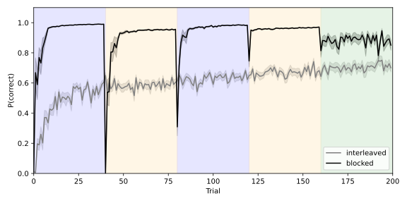
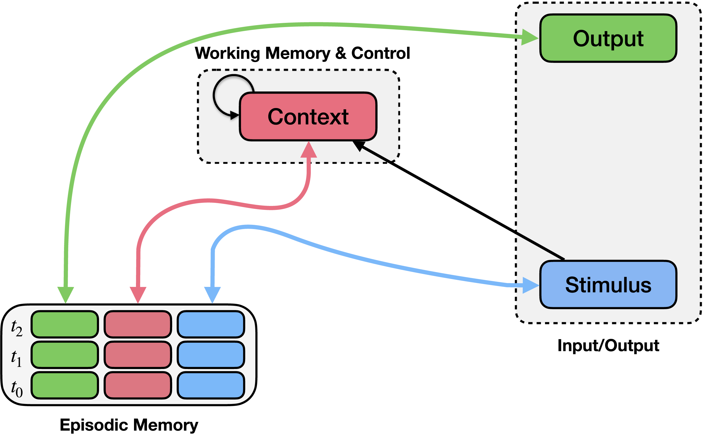
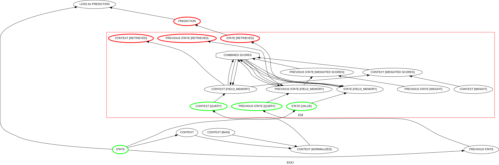

Episodic Generalization and Optimization (Giallanza et al., 2024)
==================================================================
`"Toward the Emergence of Intelligent Control: Episodic Generalization and Optimization" <https://direct.mit.edu/opmi/article/doi/10.1162/opmi_a_00143/121081>`_

Overview
--------
This example implements the Episodic Generalization and Optimization (EGO) framework described by `Giallanza et al. (2024) <https://direct.mit.edu/opmi/article/doi/10.1162/opmi_a_00143/121081>`_. The framework proposes that flexible learning and generalization arise from interactions between episodic memory and context-dependent control mechanisms. In the model, episodic memory rapidly stores experiences consisting of stimuli, contexts, and outcomes, while a recurrent context mechanism maintains task-relevant contextual information and guides retrieval of relevant memories.

Here we replicate study 2 of the paper, which investigates how the temporal structure of experience affects learning. Specifically, it examines a sequential prediction task in which identical states appear in different transition structures depending on the underlying context. Empirical findings show that participants perform better when these contexts are presented in blocked sequences than when they are interleaved.

.. _ego_csw_blocked_vs_interleaved:

   **Results of Study 2.** Performance of the EGO model after blocked and
   interleaved training on the sequential prediction task described in
   Giallanza et al. (2024).

The Model
---------
The model consists of three main components: a context integration mechanism, a learned context representations, and an episodic memory mechanism.

The context integration mechanism maintains a representation of recent stimulus history. On each timestep, the current stimulus is combined with the previous context, producing a temporally smoothed context representation that reflects the recent sequence of states.

The model then learns a mapping that transforms this integrated context representation into a form that is useful for memory retrieval. This learned transformation allows the system to shape the context representation.

The episodic memory mechanism stores combinations of stimulus, learned context representation, and successor state. When a new stimulus is encountered, the model queries episodic memory using the current stimulus and context representation. Similar past experiences are retrieved and used to generate a prediction of the next state in the sequence.

Schematic Model Architecture
~~~~~~~~~~~~~~~~~~~~~~~~~~~~
A schematic of the EGO architecture used in the simulations is shown below.

.. _ego_model_schematic:

    **EGO framework schematic (reproduced from Giallanza et al., 2024).** The EGO framework consists of a control mechanism (context module; upper middle) and an episodic memory mechanism (bottom left). Episodic memory records conjunctions of stimuli (blue boxes), contexts (pink boxes), and observed responses (green boxes) at each time point (rows). Bidirectional arrows connect episodic memory to the stimulus, context, and output, indicating that these values can be stored in or used to query episodic memory, or retrieved from it when another field is queried. The context module integrates previous context (recurrent connection) along with information about the stimulus and the context retrieved from memory.

PsyNeuLink Implementation
~~~~~~~~~~~~~~~~~~~~~~~~~
The PsyNeuLink implementation of the model used in this example is shown below.

.. _ego_model:

.. figure:: _static/ego_csw.svg
   :figwidth: 100 %
   :align: center
   :alt: Giallanza et al., Model graph implemented in PsyNeuLink

PsyNeuLink implementation (using EMComposition):

Please note:
------------
Note that this script implements a slightly different Figure than in the original Figure in the paper. The differences are explained in the comments of the code. The overall pattern of the results is the same.

Script: :download:`Giallanza2024_ego_study2.py <../../psyneulink/library/models/Giallanza2024_ego_study2.py>`

.. Jupyter Notebook Tutorial on the EGO model: `ego_csw_nb`