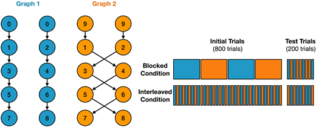

Episodic Generalization & Optimization (EGO; Giallanza, Campbell, & Cohen, 2024)
===============================================================================
`"Toward the Emergence of Intelligent Control" <https://doi.org/10.1162/opmi_a_00143>`_

Overview
--------

Human cognition excels both in the range of tasks we can perform and in how quickly we learn new tasks. A central hypothesis is that people acquire knowledge that generalizes across tasks and then flexibly apply it to guide goal-directed behavior.

`Giallanza et al, 2024 <https://doi.org/10.1162/opmi_a_00143>`_ propose the Episodic Generalization and Optimization (EGO) framework with three interacting components that together support this flexibility:

- (1) an episodic memory module that rapidly stores and retrieves relations among stimuli, outcomes, and context;
- (2) a semantic pathway that learns more slowly and maps stimuli to responses; and
- (3) a recurrent context module that maintains task-relevant context over time and uses it both to cue recall of appropriate episodic memories and to bias processing in the semantic pathway toward context-relevant features and responses.

Using shared mechanisms, the framework aims to account for phenomena across domains such as reinforcement learning, event segmentation, and category learning. Here, we illustrate PsyNeuLink implementations of Study 2 from the paper that highlight EGO's ability to leverage episodic memory and context to support generalization in changing environments.

The Task Environment
--------------------

Participants (and models) learn to predict the next state in a simple transition environment. The transition structure varies between two different context. The training schedules differs between two conditions:

- Blocked: transitions are learned in coherent blocks of stable context within a block.
- Interleaved: The two contexts are interleaved and alternate in the training phase.

Key result. Under blocked training, both humans and the EGO-style model maintain near-ceiling next-state prediction accuracy throughout, including a final test segment with interleaved trials (yellow shading). Under interleaved training, performance stays near chance. By contrast, a standard LSTM (without episodic memory) shows the reverse pattern: it struggles after block switches (and at the start of the interleaved segment) in the blocked condition, yet reaches near-ceiling performance under interleaving.

.. _EGO_Study2_Task_Fig:

Script: :download:`Download Giallanza_EGO_2024.py <../../psyneulink/library/models/GiallanzaEGO2024.py>`
