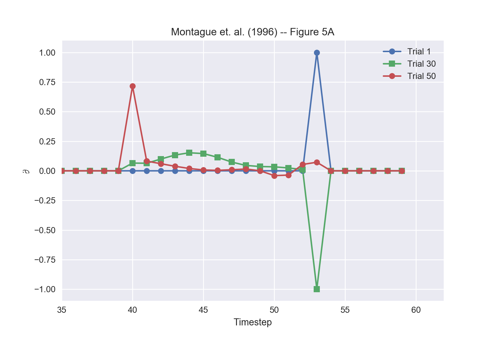

Dopamine and Temporal Differences Learning (Montague, Dayan & Sejnowski, 1996)
==================================================================
`"A framework for mesencephalic dopamine systems based on predictive Hebbian learning." <http://www.jneurosci.org/content/jneuro/16/5/1936.full.pdf>`_

Overview
--------
This model implements the comparison of a theory of mesencephalic dopamine system
function based on predictive Hebbian learning to physiological monkey data as
found in Montague, Dayan, and Sejnowski, 1996.

In this paper, Montague, Dayan, and Sejnowski proposed that one way in which
animals learn is through making predictions and then adapting behavior based on
the errors in the prediction. This model is derived from ideas previously
presented by Sutton et. al. and Rescorla & Wagner.

The figures below are PsyNeuLink recreations of figures 5A-C in the original
paper, which show a "model for mesolimbic dopamine cell activity during monkey
conditioning. The first plot shows ∂(t) over time for three trials during
training. The second plot shows ∂(t) over all 100 trials of the model responses,
with training beginning at trial 10. In these plots, the reward was withheld
every 15 trials to simulate mistakes. The third plot demonstrates extinction of
response to the stimulus due to non-delivery of the reward after trial 70.

    Figure 5A

.. figure:: _static/Montague_Figure5B.png
    :scale: 50%
    :alt: Montague Figure 5B

    Figure 5B

.. figure:: _static/Montague_Figure5C.png
    :scale: 50%
    :alt: Montague Figure 5C

    Figure 5C

The Model
---------
The basic setup for the model requires a `Transfer Mechanism <TransferMechanism>`
for sample delivery, a `TransferMechanism <TransferMechanism>` for action 
selection, a `MappingProjection <MappingProjection>` to connect the two 
TransferMechanisms, and a `LearningProjection <LearningProjection>` to execute 
the learning aspect of the model.

The `MappingProjection <MappingProjection>` represents the weights; thus, the 
projection's matrix is initialized to all zeros. The 
`LearningProjection <LearningProjection>` is initialized with 
`TDLearning <TDLearning>` as its `learning_function`; this directs the process 
containing this LearningProjection to initialize a 
`PredictionErrorMechanism <PredictionErrorMechanism>` instead of a regular 
`ComparatorMechanism <ComparatorMechanism>`. All of the functions in the script 
use the same basic setup with adaptations made to the samples and targets 
provided to correspond to the aspect of the experiment that they are modeling.
The model can be visualized as shown below.

.. figure:: _static/MontagueModel.png
    :scale: 50%
    :alt: Montague System graph

    System graph

Script: :download:`Download MontagueModel.py <../../psyneulink/library/models/MontagueDayanSejnowski96.py>`
