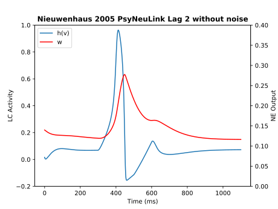
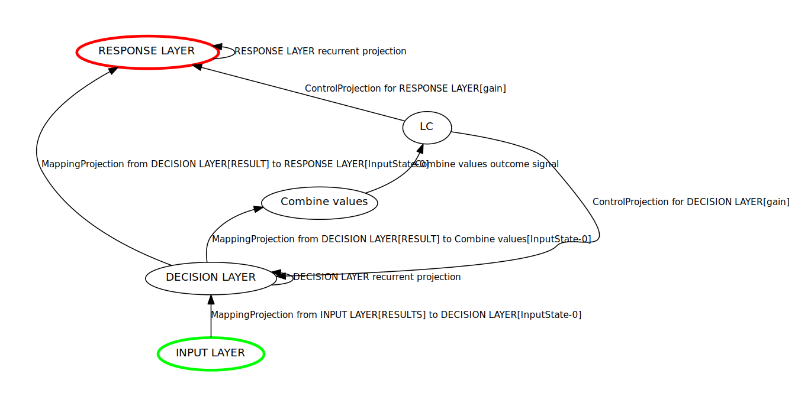

Nieuwenhuis et al. (2005)
=========================
`"The Role of the Locus Coeruleus in Mediating the Attentional Blink: A Neurocomputational Theory" <https://research.vu.nl/ws/files/2063874/Nieuwenhuis%20Journal%20of%20Experimental%20Psychology%20-%20General%20134(3)-2005%20u.pdf>`_

Overview
--------

This model implements a hypothesis concerning the role of the `locus coeruleus (LC)
<http://www.scholarpedia.org/article/Locus_coeruleus>`_ in mediating the `attentional blink
<http://www.scholarpedia.org/article/Attentional_blink>`_. The attentional blink refers to the temporary impairment
in perceiving the second of two targets presented in close temporal proximity.

In the `attentional blink paradigm <http://www.scholarpedia.org/article/Attentional_blink>`_, each trial consists of a
rapidly presented sequence of stimuli, one of which is marked as a target (e.g., by being a different color, or by being
a digit rather than a letter).  The participant is asked to observe the sequence, then identify the target (T1) as well
as the stimulus that immediately follows it (T2).  A consistent finding is that accuracy with which both T1 and T2 are
identified depends on the lag between them. In particular, accuracy is high when T2 is presented *immediately* after T1,
drops when T2 is presented between 200 and 300ms after the onset of T1, and is restored at delays longer than 400ms.

The model described by Nieuwenhuis et al. (2005) suggests that these findings can be explained by phasic activation
of LC in response to T1, and the concomitant effects of norepinephrine (NE) release on neural gain, followed by
refractoriness of the LC/NE system after a phasice response.  The model demonstrates that accuracy in identifying T2
depends on:
   * whether T1 was accurately identified;
   * the lag between T1 and T2;
   * the `mode of the LC <LCControlMechanism_Modes_Of_Operation>`
     (phasic or tonic -- see `<https://www.ncbi.nlm.nih.gov/pubmed/8027789>`_).

The Figure below shows the behavior of the model for a single execution of a trial with a lag of 200ms (without noise),
corresponding to the conditions reported in Figure 3 of Nieuwenhuis et al. (2005; averaged over 1000 executions with
noise).

.. _Nieuwenhuis2005_PsyNeuLink_Fig:

.. _Nieuwenhuis2005_MATLAB_Fig:

.. figure:: _static/Nieuwenhuis2005_MATLAB.svg
   :figwidth: 45 %
   :align: left
   :alt: Nieuwenhuis et al. 2005 plot produced by MATLAB

The Model
---------

The model is comprised of two subsystems: a behavioral network, in which stimulus information feeds forward from an
input layer, via a decision layer, to a response layer;  and an LC subystem that regulates the gain of the units in
the decision and response layers.  Each of the layers in the behavioral network is implemented as a pathway of
`TransferMechanism <TransferMechanism>` and `LCA` Mechanisms, and the LC subystem uses an `LCControlMechanism` and
associated `ObjectiveMechanism`, as shown in the figure below:

.. _Nieuwenhuis2005_System_Graph:

Behavioral Network Subsystem
~~~~~~~~~~~~~~~~~~~~~~~~~~~~

**INPUT LAYER**:  a `TransferMechanism` with **size**=3 (one element for the input to the T1, T2 and distractor units
of the *DECISION LAYER*, respectively), and assigned a `Linear` function with **slope**=1.0 and **intercept**=0.0.

**DECISION LAYER**: an `LCA` Mechanism of **size**=3 (one element each for the T1, T2 and distractor units),
and assigned a `Logistic` Function with a slope=1.0 and intercept=0.0.  Each element has a self-excitatory connection
with a weight specified by **self_excitation**=2.5, a **leak**=-1.0, and every element is connected to every other
element by mutually inhibitory connections with a weight specified by **competition**=1.0.  An ordinary differential
equation describes the change in state over time, implemented in the LCA mechanism by setting
**integrator_mode**=`True` and **time_step_size**=0.02.

**RESPONSE LAYER**: an `LCA` Mechanism of **size**=2, with one element each for the response to T1 and T2,
respectively, **self_excitation**=2.0, **leak**=-1.0, and no mutually inhibitory weights (**competition**=0).

**PROJECTIONS**:  The weights of the behavioral network are implemented as `MappingProjections <MappingProjection>`.
The `matrix <MappingProjection.matrix>` parameter for the one from the *INPUT_LAYER* to the *DECISION_LAYER* uses a
numpy array with a value of 1.5 for the diagonal elements and a value of 0.33 for the off-diagonal elements; the one
from the *DECISION_LAYER* to the *RESPONSE LAYER* uses a numpy array with 3.5 for the diagonal elements and 0 for the
off-diagonal elements.

LC Subsystem
~~~~~~~~~~~~

**LC**:

LCControlMechanism - uses the FHNIntegratorFunction to implement a FitzHugh-Nagumo model as a simulation of the
population-level activity of the LC.

The LCControlMechanism outputs three values on each execution:

  v (excitation variable of the FHN model) representing the state (or net input in connectionist terms) of the LC

  w (relaxation variable of the FHN model) representing noradrenergic output of the LC

 gain(t), where g(t) = G + k w(t), and G = **base_level_gain**, k = **scaling_factor**, and w(t) = the current
 noradrenergic output

The LC sends gain(t) to the *DECISION LAYER* and *RESPONSE LAYER* via `ControlProjections <ControlProjection>` in order to modulate the `gain <Logistic.gain>` parameter of their `Logistic` Functions.
Overall LC activity can be computed from v using the function h(v) = C * v + (1 - C) * d, where C = 0.90 and d = 0.5

**COMBINE VALUES**: an `ObjectiveMechanism`, specified in the **objective_mechanism** argument of the
LCControlMechanism constructor, with a `Linear <Linear>` function of **slope**=1 and **intercept**=0.  Its
**monitored_output_states** argument is assigned a `2-item tuple <InputState_State_Mechanism_Tuple>` specifying the
*DECISION LAYER* and a matrix for the `MappingProjection` from it to *COMBINE VALUES*.  The matrix is assigned as a
3x1 numpy array, with weights of 0.3 for its first two elements and 0.0 for its third, corresponding to
T1, T2 and distractor units in the *DECISION LAYER*, respectively.  This combines the values of the T1 and T2 units,
and ignores the value of the distractor unit, implementing the assumption that the distractor stimulus does not
elicit an LC response.  The *COMBINED VALUES* Mechanism conveys this combined value as the input to the LC.

.. note::
  Although the *COMBINED VALUES* Mechanism is not strictly needed -- the same `MappingProjection` and `matrix
  <MappingProjection.matrix>` used to combine the values of the *DECISION LAYER* and project to the *COMBINE VALUES*
  Mechanism could project directly to the LC (as it does in Niewenhuis et al.,2005) -- the use of *COMBINE VALUES*
  conforms to the convention that PsyNeuLink `ControlMechanisms <ControlMechanism>` are associated with an
  `ObjectiveMechanism` from which they receive their input.

Execution
---------
The total stimulus input is split into 11 periods of execution, each of which is 100 time steps long. During each period
one of the three behavioral units get activated (input=1), with the other two behavioral units switched off (input=0).
In this particular simulation T1 gets activated during the forth time period and T2 gets activated during the sixth time
period. During all other time period the distraction unit receives an input.
To reproduce Figure 3 of the Nieuwenhuis et al. (2005) paper, the output values w and v of the `LCControlMechanism` are
logged for every execution with the `log` function, and subsequently plotted.

Script: :download:`Download Nieuwenhuis2005Model.py <../../Scripts/Models/Nieuwenhuis2005Model.py>`

