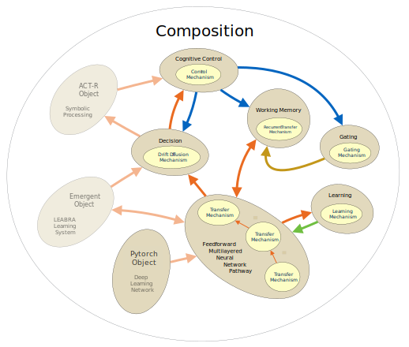

Quickstart
==========

.. contents::
   :local:
   :depth: 3

Basics
------

Overview
~~~~~~~~

PsyNeuLink models are made up of `Components <Component>` and `Compositions <Composition>`: Components are objects that perform a specific function, and Compositions are used to combine Components into a model. There are two primary kinds of Components: `Mechanisms <Mechanism>` and `Projections <Projection>`. For those familiar with block modeling systems, Mechanisms are the "blocks" in PsyNeuLink, and Projections are the "links". Mechanisms take inputs, use a function to process them in some way, and generate outputs that can be sent to other Mechanisms.  Projections allow the output of one Mechanism to be transmitted to another. `Compositions` combine these Components into pathways that constitute a `computational graph <https://en.wikipedia.org/wiki/Graph_ (abstract_data_type)>`_, in which the Mechanisms are nodes and Projections are directed edges. Compositions can also be nodes, so that one Composition can be nested inside another to create more complex, hierarchical models (e.g., of circuits or pathways within a larger system-level model). A `Scheduler` coordinates the execution of all of the Components in a model. By default, it executes them in the order determined by the Projections among the Mechanisms and/or nested Compositions. However, individual Components can be assigned one or more pre-specified or customized `Conditions <Condition>` to handle more complex structures, such as feedback pathways, and/or the execution of Components at different time scales (e.g., a recurrent network that needs time to settle before passing information to a decision layer).

Mechanisms and Projections
~~~~~~~~~~~~~~~~~~~~~~~~~~

Mechanisms and Projections fall into two broad categories:  `ProcessingMechanisms <ProcessingMechanism>` *directly transmit* and possibly *transform* information, and are linked by `PathwayProjections <PathwayProjection>` that transmit the information between them. `ModulatoryMechanisms <ModulatoryMechanism>` *modify* or *modulate* the transmission and transformation of information, by way of `ModulatoryProjections <ModulatoryProjecdtion>` to the Components they modulate.  PsyNeuLink provides a library of Components of each type. For example, there is a variety of ProcessingMechanisms that can be used to transform, integrate, and evaluate information in various ways (e.g., to implement layers of a feedforward or recurrent neural network, or a drift diffusion decision process); and there are `ModulatoryMechanisms <ModulatoryMechanism>`, including `ControlMechanisms <ControlMechanism>`  that can be used modulate the functioning of ProcessingMechanisms, and `LearningMechanisms <LearningMechanism>` that can be used to modify Projections, respectively.  The `function <Mechanism_Base.function>` of a Mechanism defines the operation it carries out. PsyNeuLink provides a rich `library <Functions>` of mathematical, statistical and matrix manipulation functions. However, a Mechanism can also be assigned any Python function that is consistent with that Mechanism's type (see `BasicsAndPrimer_Customization`). Since Mechanisms can implement virtually any function, Projections ensure that they can "communicate" with each other seamlessly.

Together, these elements allow PsyNeuLink to implement and integrate processes of different types, levels of analysis, and/or time scales of operation, composing them into a coherent system.  This affords modelers the flexibility to commit each part of their model to a form of processing and/or level of analysis that is appropriate for that part, while providing the opportunity to test and explore how they interact with one another at the level of the entire system.  The figure below provides an example of the kinds of elements available in PsyNeuLink, and some that are planned for future inclusion. The `QuickReference` provides a more detailed overview of PsyNeuLink objects and its other facilities.  In the sections that follow, the Primer provides some examples of how these are used to construct models in PsyNeuLink.

.. _BasicsAndPrimer_GrandView_Figure:

    **PsyNeuLink Environment.**  Full-colored items are examples of currently implemented elements; dimmed
    items are examples of elements planned for future implementation.

.. include_notebook:: notebooks/quickstart.ipynb

.. STUFF TO ADD -------------------------------------------------------------------------------------------------------
.. XXX NESTED COMPOSITIONS (BEYOND AUTODIFF)
.. XXX COMPILATION INCLUDING EXAMPLE WITH timeit TO SHOW IMPROVEMENT!
