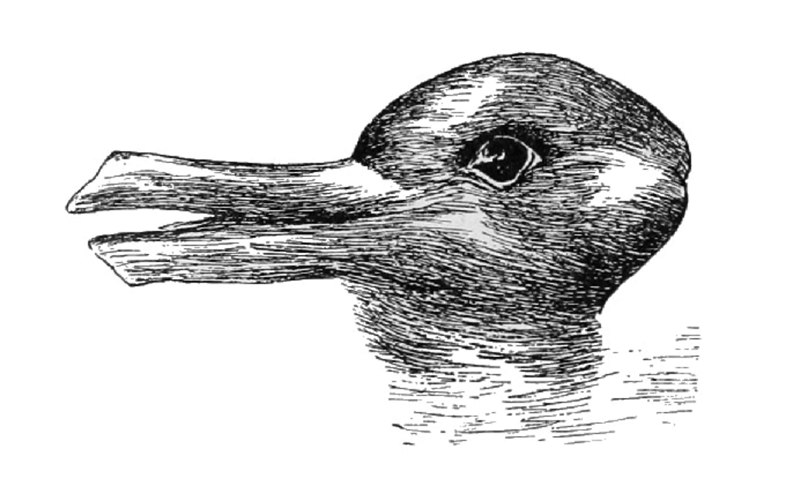

1 Dynamics In Perception
========================

Overview
--------

In this chapter we will explore dynamic models using some examples from perception. We'll start with introducing *Hebbian Learning*, then introduce a *Hopfield Network* ([Hopfield, 1982](https://doi.org/10.1073/pnas.79.8.2554)) that takes noisy input and settles on a stable interpretation, then we'll explore some simple examples of dynamic networks evolving over time, and finally consider *bistable percepts* that can be interpreted multiple ways. Along the way we'll cover numerous examples and concepts that recur and are useful throughout this course.

.. toctree::
    :maxdepth: 1

    notebooks/1_hebbian_learning
    notebooks/2_hopfield_networks
    notebooks/3_dynamic_systems_and_bistable_perception
