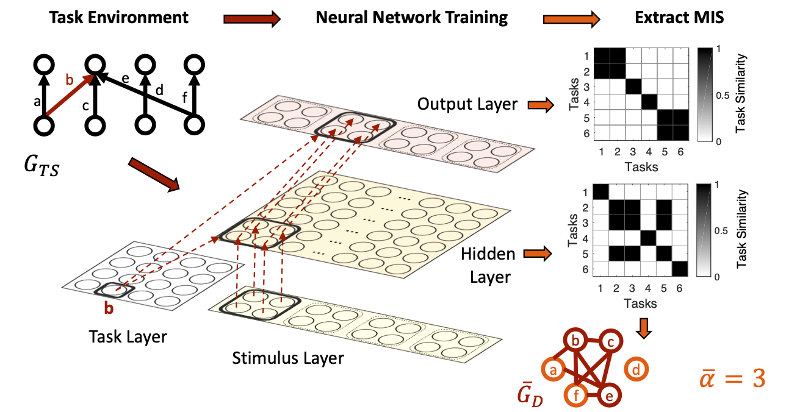

# Petri et al 2021

This directory contains an implementation of the multitasking simulation in
Petri et al.

[simulation.py](simulation.py): the main script that configures (using 
[configure.py](configure.py)), trains, and runs the neural network model and 
runs the analysis on the output data.

[configure.py](configure.py): script that configures the neural network 
according to the simulation's parameters. This is run by simulation.py and does 
not need to be run separately by the user.

The simulation procedure outlined in Petri et al. (2021). A bipartite task structure graph (task environment) describes tasks in terms of mappings from an input space to an output space. Each task corresponds to an edge from an input node to an output node (e.g., task b). A neural network is trained on a set of tasks determined by the task structure graph, in which each task requires the network to map a set of features from the stimulus layer via a hidden layer to a set of features on the output layer. Each task is designated by a unit in an additional (task) input layer (e.g., task b) that projects to both the hidden and output layers. The network is trained on all tasks by activating, on each trial, a particular task unit and an input unit corresponding to a stimulus feature in the set for that task, and requiring the network to activate the corresponding output unit. The average activity patterns at the hidden and output layers across all inputs under a given task are taken as the network’s representation of that task. The two resulting similarity matrices (for the hidden and output layers) are used to infer dependencies between tasks based on shared task representations, and to construct an empirical task dependency graph, which is used to predict the parallel processing capacity of the network.

### Running the Simulation

The simulation can be run using the simulation.py script. The script takes three
arguments:
- graph_input: the number of the bipartite task structure graph to be used
- hidden_arg: the number of hidden layers in the neural network
- silence: whether to silence debug messages while running the simulation

### Simulation Paramters

The simulation uses the following parameters, defined in configure.py:
- init_scale: scales for initialized random weights
- learning_rate: learning rate
- decay: weight penalization parameter
- bias: weight from bias units to hidden & output units
- thresh: mean-squared error stopping criterion
- hidden_path_size: size of a subset of hidden units that each receive the same 
weights from the task layer
- output_path_size: size of a subset of output units that each receive the same 
weights from the task layer